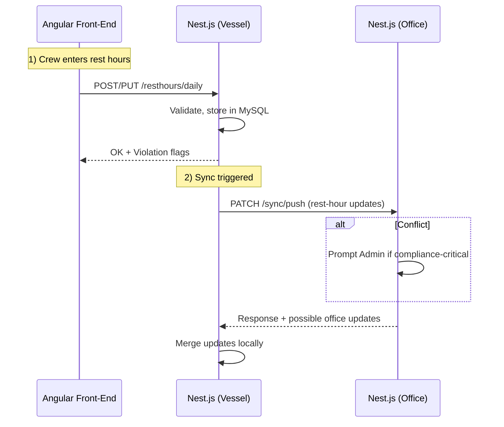
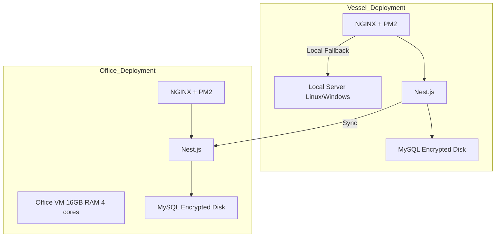

## L1-HLD: High-Level Design (HLD) Document

This document provides a concise, high-level overview of the SafeLanes Rest Hours solution's architecture. It describes the major system components, their interactions, data flows, technology choices, security strategies, and deployment considerations. Detailed low-level design specifications and granular implementation details are documented separately in L3-LLD (component-level) documents.

---

## 1. Architecture Overview
This section summarizes the overall structure of the system, highlighting how vessel-based subsystems and the office environment integrate to achieve rest-hour logging, validation, and reporting. The solution operates partially offline on vessels, synchronizing with the office when connectivity is available. Vessel-initiated pushes or pulls are employed for data sync, avoiding inbound firewall configurations.

```mermaid
flowchart LR
    A[Vessel Devices<br> (Crew/Admin UI)] -->|Local LAN| B(Vessel Server<br> - Nest.js + MySQL)
    B -->|Outbound Sync| C[Office Server<br> - Nest.js + MySQL]
    C --> D[Office Users<br>(Admin/Super Admin)]
    D -->|Browser| C
    B -- Offline Fallback --> A
```

### Key Highlights
- Vessel environment includes an on-prem server running the Nest.js backend and MySQL.  
- Office environment has a similar Nest.js instance and MySQL database, aggregating data across the fleet.  
- Angular microfrontends (vessel/office) connect to their local or remote Nest.js backends.  
- Synchronization is vessel-initiated (daily or on-demand via secure TLS). Conflicts in compliance-critical data require a manual Admin decision.  

---

## 2. System Components Descriptions
The solution comprises multiple logical layers and components, each addressing a distinct area of functionality. These components collectively support maritime rest-hour compliance and analytics.

```mermaid
flowchart TB
    subgraph Front-End
    A1[Angular 16 Microfrontend<br>(Office)] 
    A2[Angular 16 Microfrontend<br>(Vessel - Offline Fallback)]
    end

    subgraph Back-End
    B1[Nest.js - Vessel]
    B2[Nest.js - Office]
    end

    subgraph Databases
    C1[MySQL - Vessel]
    C2[MySQL - Office]
    end

    A1 -- REST/HTTPS --> B2
    A2 -- REST/HTTPS --> B1
    B1 --> C1
    B2 --> C2
    B1 -- Secure Sync --> B2
```

### Front-End (Angular Microfrontend)
- Deployed as a Module-Federation-based microfrontend for the existing SafeLanes "Sail App."  
- On vessels, an offline fallback bundle is served locally if remote endpoints are unreachable.  
- Office-side users see comprehensive analytics for multiple vessels, while vessel-side front-end focuses on daily logs and departmental oversight.  
Note: If the host environment cannot be upgraded to Angular 16, a minimal fallback approach (e.g., web component wrapper or an iframe-based isolation) can be employed, as outlined in L1-OVERVIEW, until the host is updated.

### Back-End (Nest.js)
- Two main deployments: one on each vessel, another at the office.  
- Provides REST APIs for data submission, validation, and retrieval.  
- Implements business logic for rule checks (MLC/STCW/OPA), conflict resolution policy, and incremental synchronization.

### Databases (MySQL)
- Vessel database stores offline data and merges it with the office DB when online.  
- Office database aggregates the fleet's rest-hour information, enabling advanced analytics.  
- Daily snapshot backups are recommended; disk encryption is often used (see Security sections) to protect data at rest.

---

## 3. Inter-Component Communication
High-level API communication ensures consistent data flow between front-end UIs, back-end services, and databases. The vessel server exchanges data with the office server through secure outbound connections initiated by the vessel.



### Communication Protocols & Data Formats
- REST/HTTP over TLS (HTTPS).  
- JSON payloads for rest-hour data and metadata.  
- Vessel-initiated sync avoids inbound firewall complexities.  

---

## 4. Data Architecture Details
Below is a simplified depiction of how data flows between sources (crew, office admins), processes (Nest.js logic), and storage (databases). Each vessel maintains offline autonomy, merging with the office DB.

```mermaid
flowchart LR
    subgraph Vessel
        A[Crew Inputs] --> B[Daily Rest-Hour Records]
        B --> C{Local DB <br>(MySQL)}
        C --> B
    end

    subgraph Office
        D[Office Users] --> E[Analytics/Reports]
        E --> F{Office DB <br>(MySQL)}
        F --> E
    end

    C -- Incremental Sync --> F
    F -- Return Sync Mods --> C
```

### Data Flow & Storage Strategy
- One record per crew member per day, subdivided into 48 half-hour blocks.  
- UpdatedAt timestamps support incremental sync.  
- Conflict resolution logs overwritten records in an immutable audit table.  
- Rule sets are versioned; forward-only checking applies to new entries.  

---

## 5. Integration Points
Integration points exist for authentication, external read-only auditor access, and the existing SafeLanes infrastructure:

1. SafeLanes Identity Service (JWT)  
   - Vessel back-end validates tokens when online or manages short-lived offline session keys up to 14 days.  
2. SAIL App Host (Angular Shell)  
   - Loads the rest-hour microfrontend modules, controlling role-based UI exposure.  
3. Auditor/External Access (Optional)  
   - View-only roles, restricted to read data for compliance reviews.  

---

## 6. Technology Choices

### Front-End
- Angular 16 with Module Federation for microfrontend integration.  
- Offline fallback bundling on the vessel for uninterrupted usage.

### Back-End
- Nest.js (TypeScript) for robust REST services, modular design, and straightforward rule-engine integration.

### Database
- MySQL 8.x on both vessel and office sides, balancing reliability and ease of offline usage.

### Encryption & Security
- Encryption at rest is strongly recommended but subject to client policy. If implemented, full-disk encryption can simplify vessel-side security.  
- TLS 1.2+ for data in transit.  
- Internal CA with certificates for vessel connections; rotating these certificates periodically (e.g., within 12 months) is recommended to mitigate potential compromise.

### CI/CD & Deployment
- Script-based build, test, and package approach (no Docker).  
- PM2 process manager and Nginx reverse proxy on both vessel and office servers.

---

## 7. Security Architecture Overview
Security focuses on role-based authentication, data encryption, and offline session handling. Compliance-critical conflict resolution ensures no silent overwrites occur without Administrator approval.

```mermaid
flowchart LR
    A[User w/ JWT] -->|Login Request| B[Vessel Nest.js]
    B -->|Check Token or Offline Key| C[Local Auth Logic]
    B -->|Authorized Access| D[MySQL + FDE]
    B --Diff--> E[Conflict Detection<br>(Compliance Data?)]
    E --Escalate--> F[Admin Decision Required]
```

### Authentication & Authorization
- JWT-based login when online; short-lived session keys for offline periods (~14 days).  
- Vessel Master (Super Admin) can override offline expirations.  
- Predefined roles limit access (Vessel User, Admin, Office User, etc.).  

### Data Protection
- Encryption at rest is strongly recommended. If chosen, full-disk encryption (a simpler operational approach) can help secure MySQL data at rest on both vessel and office.  
- All data synchronization and user traffic occur over TLS to prevent interception.

### Compliance Considerations
- If conflicting rest-hour edits are detected, the system defers final overwrite until an Admin confirms.  
- Overwritten data is preserved in an immutable audit log for potential external review.  

---

## 8. Deployment Architecture
The software is deployed on a dedicated server for each vessel (offline-ready) and a central office server. Daily snapshot backups are recommended in both environments. Vessel servers use PM2 + Nginx to host the Nest.js application and serve the Angular microfrontend fallback.



### CI/CD Processes
- Source code is built, tested, and packaged into installers or deployment bundles.  
- Office environment updates can be applied more frequently.  
- Vessel updates are typically installed during scheduled port calls or stable connectivity periods, including the microfrontend fallback bundle and DB schema scripts.

---

## 9. Constraints and Assumptions
Finally, the overall solution operates under specific constraints and assumptions that guide its design:

1. **Offline Operation**: Vessels can be offline for up to 14 days. Automatic daily sync occurs when internet connectivity is available; manual overrides exist if the period extends.  
2. **Forward-Only Rule Updates**: New rest-hour rules apply going forward rather than re-validating historical logs.  
3. **Conflict Resolution**: Compliance-critical data merges require Admin decisions. If no admin is available, the conflict remains pending or escalates after a defined period.  
4. **Moderate Concurrency**: Up to 30 crew per vessel, ~100 office concurrent users.  
5. **Data Retention**: Full data is retained indefinitely to satisfy maritime regulations.  
6. **Office DB as Canonical**: In case of vessel DB corruption, the vessel can re-download from office and re-enter unsynced data if needed.  
7. **No Overengineering**: The architecture remains streamlined for the current project scale, with flexible but not overly complex features to support future expansion.

---
