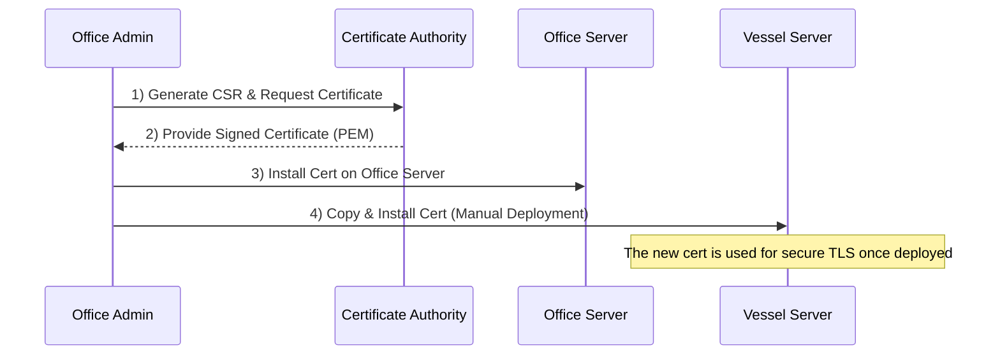
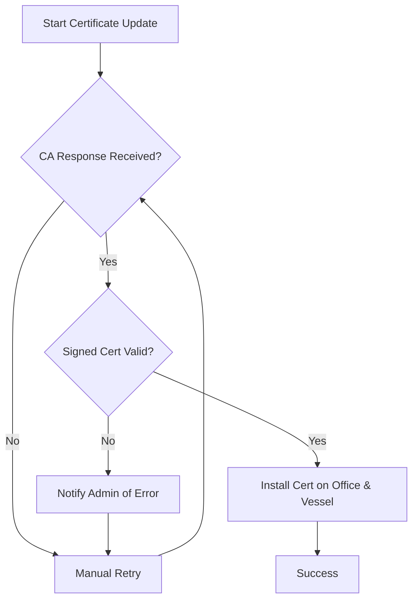

## L2-LLD-INTG3P: Integration with Third-Party Services Document

## 1. Introduction

This document describes how the SafeLanes Rest Hours solution integrates with external third-party services. Given the current requirements, the solution is largely self-contained, and no external services are used for core rest-hour data or compliance checks (MLC, STCW, OPA). The primary external integration at this stage is with a Certificate Authority (CA) for obtaining and deploying TLS certificates to secure vessel-to-office communication.

Where future needs arise (e.g., external email delivery, real-time notifications, or advanced audits), the patterns in this document will guide expansions. The emphasis remains on a pragmatic approach that suits the moderate scale of this maritime solution.

---

## 2. External Service Interfaces

The only significant third-party interaction in this system is the manual acquisition and renewal of TLS certificates from a recognized Certificate Authority (CA). No other external APIs (e.g., for data analytics, payment, or shipping) are integrated into this rest-hour subsystem at present.

### 2.1 Third-Party CA (Certificate Authority)

• The Office Server (and optionally each vessel server) must acquire valid TLS certificates from a recognized CA.  
• The recommended procedure for acquiring or renewing TLS certificates is as follows:

1. Generate a Certificate Signing Request (CSR) using a standard command-line utility such as OpenSSL or a provider-specific tool.  
2. Submit the CSR to the CA via their web portal or CLI workflow.  
3. Once the signed certificate (PEM file) is received, install it on the Office Server.  
4. For vessel servers, copy the same or a separately issued signed certificate to each vessel, where authorized staff manually install it during scheduled port calls or secure maintenance windows.

• Private key management and credential protection are handled according to SafeLanes' policies. Admins must store private keys in a secure file location (restricted OS-level permissions) and rotate or renew them in alignment with SafeLanes' security guidelines. This ensures minimal risk of unauthorized key exposure or tampering.

• Vessel servers, which can remain offline for extended periods, rely on admin-led processes to install or renew certificates during port calls or scheduled maintenance windows.  
• Certificate validity typically spans one year, ensuring that potential disruptions (e.g., mid-ocean auto-renew failures) are minimized.

---

## 3. API Integrations

Currently, there are no direct REST API calls to external providers for the SafeLanes Rest Hours module. All essential logic (rules checking, offline/online synchronization, conflict resolution) runs between the Vessel and Office back-ends, with no external web services involved.

In the future, if automated certificate renewal with an external CA is desired (e.g., Let's Encrypt), a minimal additional integration could be introduced. Such a feature would require stable connectivity and scheduling to avoid certificate lapses when vessels are offline.

---

## 4. Authentication Methods

For the TLS certificate process, only manual credential verification is performed with the designated CA (usually a web-based or command-line certificate request flow). No OAuth flows or API keys for third-party services are in use. The SafeLanes identity service (JWT-based) is internal and therefore not considered a third-party for this context.

---

## 5. Data Transformation

No external data formats are transformed within the system because no external data feeds (beyond the certificate issuance) exist. All rest-hour data is stored and processed internally. The TLS certificate exchange involves standard PEM-encoded keys and certificates but does not affect run-time rest-hour data.

---

## 6. Error Handling for External Services

Although external dependencies are minimal, there are a few considerations for handling certificate-related issues. These revolve around unresponsive or unreachable CA endpoints when obtaining or renewing certificates and ensuring the system remains functional until the admin addresses the issue.

### 6.1 Timeout and Retry Policies

• If an admin attempts to request or renew a certificate from the CA and the request times out, they are expected to retry the request manually.  
• Vessel-side processes do not auto-retry certificate renewals, reducing the risk of partial updates when offline.

### 6.2 Fallback Mechanisms

• If a new cert cannot be obtained or updated promptly, the system continues using the existing certificate until the admin installs the replacement.  
• An expired certificate might lead to security warnings or blocked HTTPS sessions, so admins are advised to track expiration dates to minimize disruptions.

### 6.3 Notification Systems

The solution currently does not integrate with external email or SMS services for certificate-expiry notifications.  
• However, administrators can implement a simple local scheduling script or cron job on the Office Server (and optionally on the vessel servers) to monitor certificate expiration dates, logging messages or displaying reminders on an internal dashboard whenever an upcoming expiry threshold (e.g., 30 days) is reached.  
• Maintaining a spreadsheet or a small local database of certificate expiry dates is another low-complexity approach that aligns with the current solution's scale.

---

## 7. External Service Interaction Diagram

The following sequence diagram illustrates how the Office Admin manually acquires a TLS certificate from a CA, then deploys it to vessel servers:

1. The admin first generates a CSR (Certificate Signing Request) and submits it to the CA.  
2. The CA returns a signed certificate (PEM format).  
3. The admin manually installs the certificate on the Office Server.  
4. The admin securely transfers the same (or a separately issued) certificate to Vessel Servers during port calls or via secure channels, completing the deployment process.

---

## 8. Error Handling Flow Diagram for External CA Integration

If the certificate request or issuance fails, the system follows these steps:

• If the CA is unreachable or returns an error, the admin manually retries.  
• If the CA returns an invalid or malformed cert, the system logs an error and awaits further admin action.  
• Once a valid certificate is obtained, admins install it on the servers and verify secure connections.

---

## 9. Final Remarks

At present, the SafeLanes Rest Hours solution has minimal third-party integration requirements beyond the manual acquisition and deployment of TLS certificates. This straightforward approach suits the offline maritime setting, where fully automated renewals can be impractical. Any future integrations—such as automated certificate renewal, external notification services, or advanced auditor platforms—would build on the same fundamental patterns of manual fallback, minimal external dependencies, and robust error handling to maintain operational continuity.  
