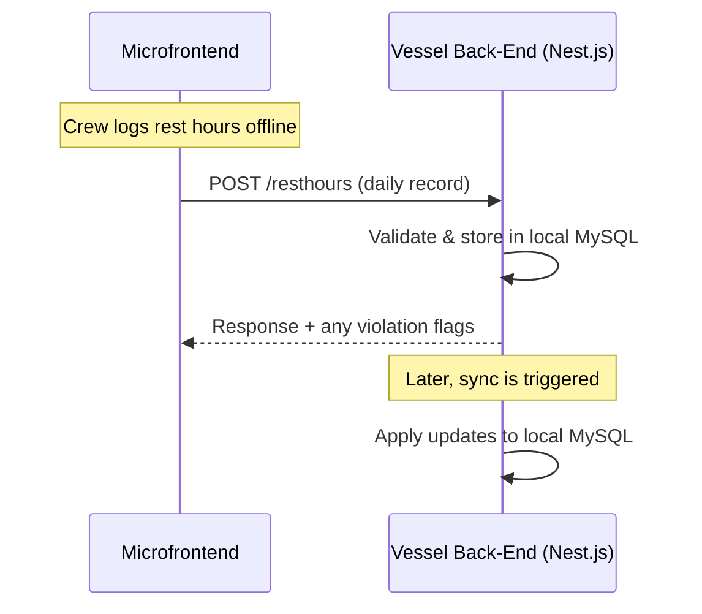
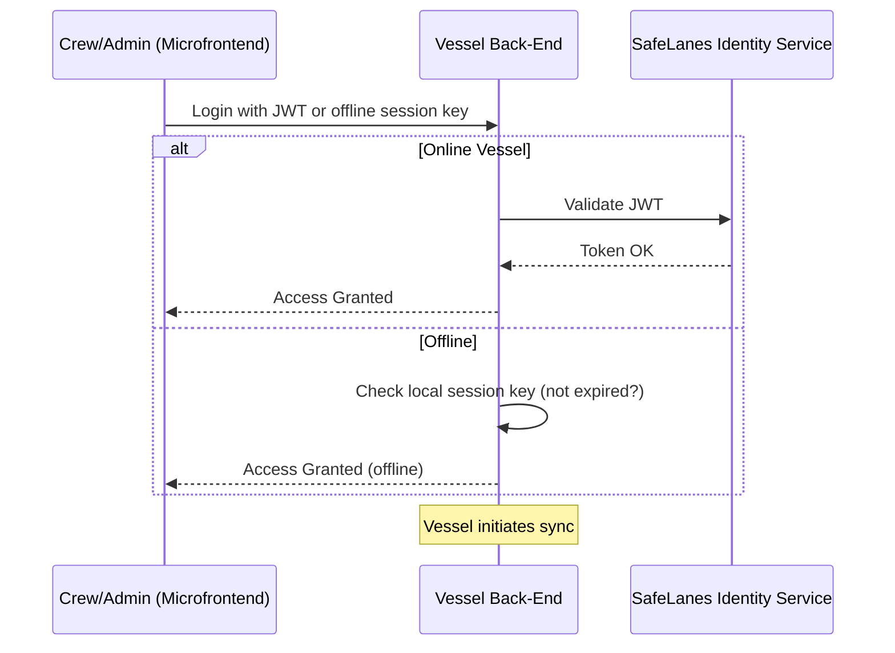

L2-LLD-IC: Inter-Component Interaction Design Document
1. Introduction
This Level 2 Low-Level Design document focuses on how the key solution components (Vessel Back-End, Office Back-End, and Microfrontends) interact with each other to implement the SafeLanes Rest Hours Submodule. It describes the communication patterns, synchronization flows, authentication handshakes, and data exchange endpoints used when different parts of the system coordinate to maintain compliance-critical rest-hour data. Internal component designs (e.g., specific class structures or internal database schemas) are not covered here; those appear in separate L3-LLD documents.

2. Inter-Component Communication Patterns
The system is composed of: 

• Vessel Back-End (Nest.js + MySQL), serving local users (crew) and synchronizing with the Office Back-End.
• Office Back-End (Nest.js + MySQL), aggregating all vessels' data and making it available to office users.
• Angular Microfrontends that communicate with either the vessel or office back-end depending on the user's location and role.

These components communicate mainly over REST APIs, secured by TLS. 
2.1 Generic Interaction Flow
The diagram below depicts a typical daily usage scenario (for rest-hour logging, visualization, and synchronization):

• The Microfrontend calls the Vessel Back-End for daily operations when on the vessel and the Office Back-End from shore offices.
• The Vessel Back-End initiates synchronization with the Office Back-End, handling incremental updates based on updatedAt timestamps.

3. Cross-Component Authentication Flow
All user-facing interactions require valid SafeLanes JWT tokens The diagram below shows how vessel and office environments handle authentication:

the Nest.js back-end on the vessel uses a local record of roles and JWT to keep the user authenticated only on the vessel..
The Office always communicates with the identity service in real time to confirm tokens.

4. Role-Based Access Control (RBAC)
Inter-component calls rely on roles embedded in JWT/session keys:

Vessel Roles: Vessel User, Vessel Admin, Vessel Super Admin.
Office Roles: Office User, Office Admin, Office Super Admin.
External: read-only role with minimal or no editing privileges.