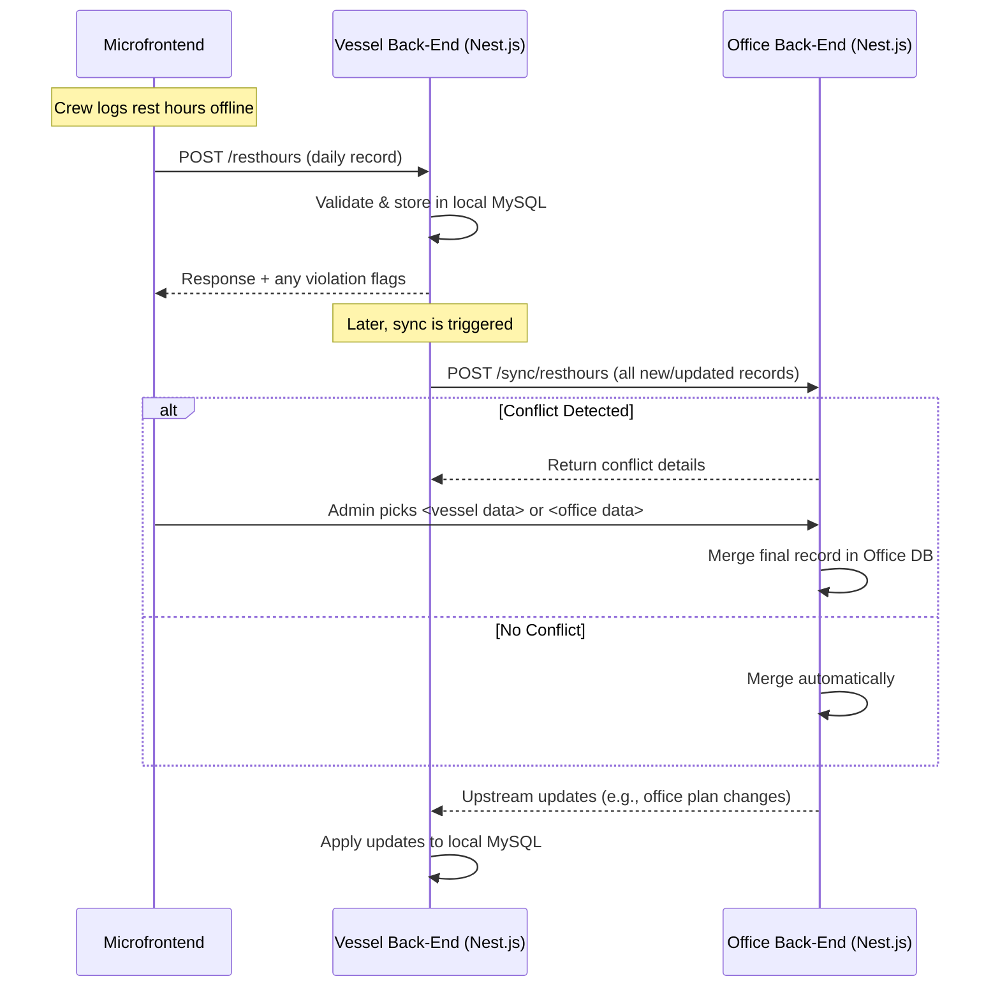
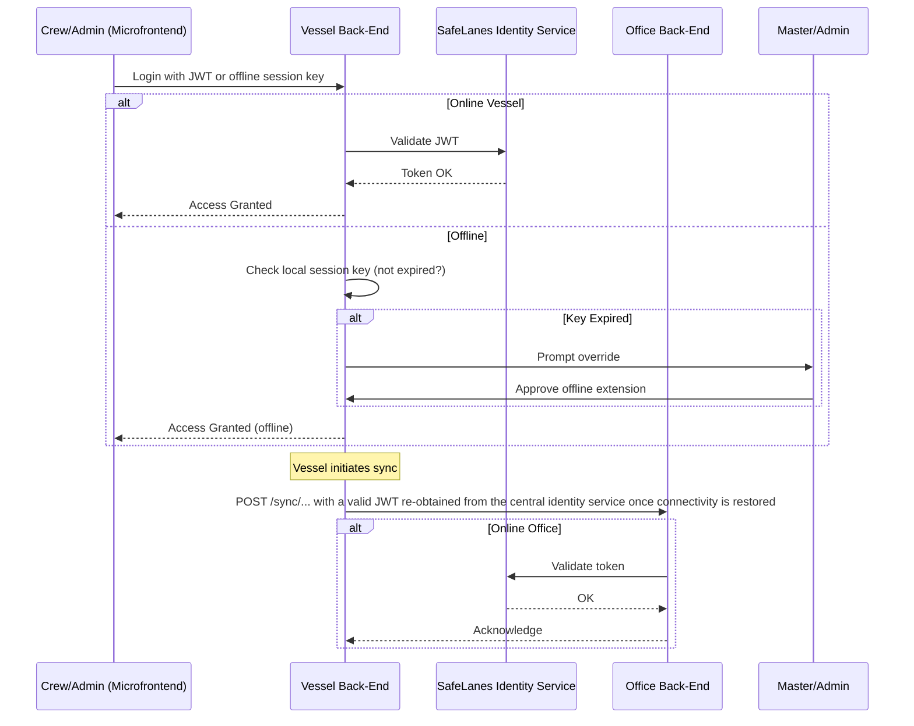

## L2-LLD-IC: Inter-Component Interaction Design Document

### 1. Introduction
This Level 2 Low-Level Design document focuses on how the key solution components (Vessel Back-End, Office Back-End, and Microfrontends) interact with each other to implement the SafeLanes Rest Hours Submodule. It describes the communication patterns, synchronization flows, authentication handshakes, and data exchange endpoints used when different parts of the system coordinate to maintain compliance-critical rest-hour data. Internal component designs (e.g., specific class structures or internal database schemas) are not covered here; those appear in separate L3-LLD documents.

---

### 2. Inter-Component Communication Patterns
The system is composed of:
• Vessel Back-End (Nest.js + MySQL), serving local users (crew) and synchronizing with the Office Back-End.  
• Office Back-End (Nest.js + MySQL), aggregating all vessels’ data and making it available to office users.  
• Angular Microfrontends that communicate with either the vessel or office back-end depending on the user’s location and role.  

These components communicate mainly over REST APIs, secured by TLS. Vessel-to-Office data flows leverage vessel-initiated endpoints (no inbound firewall changes on the vessel side). Conflict resolution for compliance-critical fields is driven by dedicated endpoints on the Office Back-End, with administrative intervention when overlaps occur.

#### 2.1 Generic Interaction Flow
The diagram below depicts a typical daily usage scenario (for rest-hour logging, visualization, and synchronization):

• The Microfrontend calls the Vessel Back-End for daily operations when on the vessel and the Office Back-End from shore offices.  
• The Vessel Back-End initiates synchronization with the Office Back-End, handling incremental updates based on updatedAt timestamps.

---

### 3. API Endpoint Specifications

This section summarizes key cross-component endpoints (primarily Vessel <-> Office). Endpoints within a single environment (e.g., microfrontend to vessel back-end on the same LAN) are documented separately in L3-LLD but generally follow similar REST conventions.

#### 3.1 Vessel–Office Synchronization Endpoints
All sync calls are initiated by the vessel. The Office Back-End provides endpoints to receive new or updated data, and to return any data the vessel needs (e.g., updated planning tasks).

1. POST /sync/resthours  
   • Description: Receives daily rest-hour records (or updates) from the vessel.  
   • Request Body (JSON):  
     - vesselId (string)  
     - records (array of daily records, each including: date, crewId, 48-block data, updatedAt, violation codes, etc.)  
   • Response (JSON):  
     - status: "OK" or "CONFLICT"  
     - conflicts (optional array) if compliance-critical overlaps are detected  
     - officeUpdates (array) of changed data from the Office that the vessel needs to apply  
   • Authentication: Vessel back-end uses a valid JWT issued by the central identity service once connectivity is restored.  
   • Error Handling:  
     - 401 Unauthorized if authentication fails  
     - 409 Conflict if compliance-critical data overlaps are found  

2. POST /sync/planning  
   • Description: Receives new or updated planning tasks (fixed or variable) from the vessel.  
   • Request Body (JSON):  
     - vesselId (string)  
     - tasks (array of planning tasks with start/end times, assignedCrew, updatedAt, etc.)  
   • Response (JSON):  
     - status: "OK" or "CONFLICT"  
     - conflicts (optional array) explaining any data collisions  
     - updatedPlans (optional array) with office-side updates if they exist  
   • Error Handling and Authentication rules similar to /sync/resthours  

#### 3.2 Conflict Resolution Endpoints
When conflicts arise in compliance-critical fields (e.g., daily rest-hour blocks), the Office Back-End exposes dedicated endpoints to handle them:

1. GET /conflicts  
   • Description: Office Admin or Super Admin fetches a list of pending conflicts.  
   • Response (JSON):  
     - conflicts (array) each containing recordId, vesselId, conflictType, timestamp, proposed vessel data vs. office data  

2. POST /conflicts/resolve  
   • Description: Admin decides whether to keep the vessel or office version for each conflict.  
   • Request Body (JSON):  
     - conflictId (string)  
     - resolution (string: "KEEP_VESSEL" or "KEEP_OFFICE")  
     - optional comment, reason, or override note  
   • Response (JSON):  
     - finalRecord (object) representing the merged record  
     - status: "RESOLVED"  
   • Error Handling:  
     - 404 if conflict not found  
     - 403 if user lacks Admin privileges  
   • Audit Logging: The system persistently logs the old and new values (before and after overwrite) in an immutable audit trail, fulfilling compliance traceability requirements.

---

### 4. Database Synchronization Strategies
The solution uses single-request sync for each data type. The Vessel Back-End periodically (or on demand) performs:

1. **Collect All Updated Records**: Query local MySQL for records with updatedAt > lastSyncTime.  
2. **Send Single POST**: Transmit the entire set to the Office Back-End in a JSON form.  
3. **Receive Conflicts**: If the Office sees changes it already made, it marks them as conflicts.  
4. **Return Office Updates**: The Office includes any relevant record changes for the vessel to apply.  
5. **Conflict Resolution**: If any compliance-critical clash cannot be auto-merged, it remains pending until an Office Admin calls “POST /conflicts/resolve.”

#### 4.1 Incremental Timestamps
Records carry updatedAt timestamps in UTC. The vessel references the highest known lastSyncTime to minimize payload size. If the vessel is severely offline and has many updates, it still uses a single request, potentially with a larger payload.

#### 4.2 Atomicity at Day Level
Each rest-hour record is treated as a single atomic entity for conflict checks. Partial merges are not performed block-by-block. If multiple half-hour segments within the same day changed on both sides, the entire day’s record triggers an Admin-level conflict resolution.

#### 4.3 Non-Critical vs. Compliance-Critical Fields
For non-critical data fields, a simple last-write-wins approach (based on updatedAt) may be used during sync. However, compliance-critical fields (e.g., rest-hour blocks) require explicit conflict resolution by an Admin or Super Admin whenever overlapping edits are detected.

---

### 5. Cross-Component Authentication Flow
All user-facing interactions require valid SafeLanes JWT tokens if online. When offline, short-lived session keys (max 14 days) apply only within the vessel environment. The diagram below shows how vessel and office environments handle authentication:

- When the vessel is fully offline, the Nest.js back-end on the vessel uses a local record of roles and session keys to keep the user authenticated only on the vessel.  
- Upon reconnection, the vessel must re-authenticate with the central identity service to obtain a valid JWT before any syncing to the Office Back-End, ensuring no unverified offline session keys are used for external data updates.  
- The Office always communicates with the identity service in real time to confirm tokens.

---

### 6. Role-Based Access Control (RBAC)
Inter-component calls rely on roles embedded in JWT/session keys:
- Vessel Roles: Vessel User, Vessel Admin, Vessel Super Admin.  
- Office Roles: Office User, Office Admin, Office Super Admin.  
- External: read-only role with minimal or no editing privileges.  

During synchronization, the Office Back-End requires a valid JWT from the identity service for any data submission originating from the vessel. Otherwise, it rejects or flags them for further review. Conflict resolution endpoints always require Admin or Super Admin roles, verified in the Office environment.

---

### 7. Data Encryption Standards Across Components
• **In Transit**: All vessel-to-office communication and user connections run over HTTPS (TLS 1.2+). Certificates are typically self-hosted or managed, with vessel updates installed manually.  
• **At Rest**: Each environment (Vessel, Office) can optionally use full-disk or database-level encryption. This does not change cross-component interactions but is strongly recommended to protect stored rest-hour data.  
• **Offline Session Keys**: Stored in local MySQL on the vessel, restricted to authorized roles, and never used directly by the Office environment. Once reconnected, the vessel re-authenticates with the central identity service to ensure all Office-bound requests carry a valid JWT.

---

### 8. Code Organization Across Components
For maintainability, the solution uses a **Unified Sync & Conflict Module** (within each Nest.js codebase) to manage cross-component data flows:

1. **Vessel Sync Module**  
   - Gathers updated rest-hour records and planning tasks.  
   - Sends them via POST /sync/... endpoints.  
   - Applies any returned updates or merges from the Office.  

2. **Office Sync Module**  
   - Accepts incoming sync requests.  
   - Executes conflict detection logic for compliance-critical data.  
   - Returns conflicts or merges automatically for non-critical fields.  
   - Exposes dedicated /conflicts endpoints for Admin resolution.

3. **Authentication Layer**  
   - Shared “auth” guards in Vessel and Office code to verify JWT or offline session keys (vessel-local only).  

4. **RBAC Checks**  
   - Decorators or middleware that assert whether a given route requires Admin-level permissions.  

This modular structure avoids scattering synchronization and conflict logic across multiple submodules. Each domain area (rest hours, planning data) calls into the shared sync/conflict functionality, ensuring consistent handling of offline merges and conflict resolution.

---

### Final Remarks
This Inter-Component Interaction Design highlights how the Vessel Back-End, Office Back-End, and Microfrontends exchange data, handle authentication, and resolve conflicts for SafeLanes Rest Hours compliance. By centralizing conflict detection, keeping single-request synchronization, and requiring Admin involvement for critical overwrites, the solution achieves robust maritime compliance without unnecessary complexity. Every resolution of compliance-critical conflicts is stored in an immutable audit log (holding pre- and post-change data), ensuring traceability per L1-FRS §2.8 and L1-KD Decision 4. Future expansions (e.g., chunking large data sets, advanced partial merges) remain feasible but are not mandated for the current scale.
