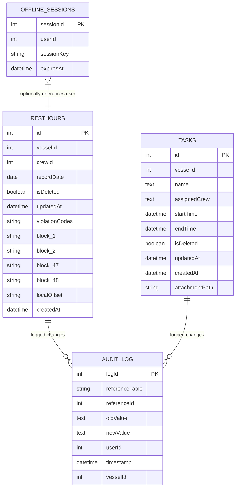
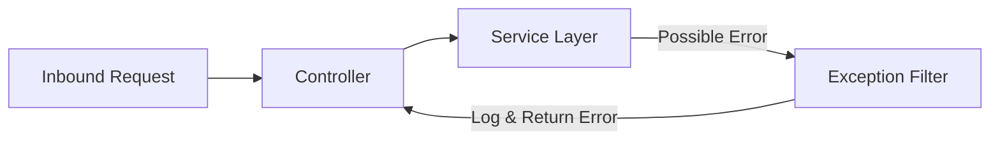
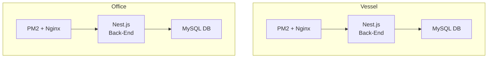
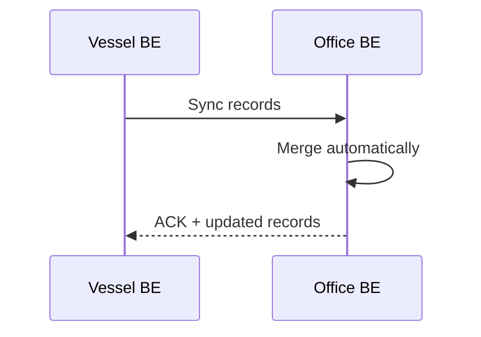

## L3-LLD-BE: Component-Specific Low-Level Design Document for BE


---

## 1. Introduction
This document provides a comprehensive low-level design (LLD) for the Back-End (BE) component of the SafeLanes Rest Hours solution, based on Nest.js and MySQL. It aims to give developers a clear, detailed guide to implement, integrate, and maintain all required features, focusing on offline vessel operation, office aggregation, last-write-wins, and indefinite data retention.

---

## 2. Component Context
The BE component runs in two main environments: (a) each vessel server (offline-capable) and (b) the office server (online, aggregating data from the fleet). Though codebases are nearly identical, certain configuration parameters (e.g., database connection settings, environment variables) differ between vessel and office. This LLD aligns with the overall scale of up to ~30 vessel users and ~100 office users, prioritizing simplicity without overengineering.

The BE interacts with:
- Angular Microfrontends (vessel or office) for CRUD operations on rest hours, tasks, and compliance checks.  
- A MySQL database on each vessel or at the office for persistent storage.  
- SafeLanes Identity Service (when online) to validate JWT tokens.  
- Optional short-lived offline session keys on the vessel when no connectivity exists.

Below is a simplified diagram recapping how the BE fits into the entire system:

```mermaid
flowchart LR
    A[Angular Front-End<br>(Vessel or Office)] --> B(Back-End<br>Nest.js + MySQL)
    B -->|Sync| C[Office Back-End<br>(Office MySQL)]
    C --> D[Office Users]
    D --> C
```

---

## 3. Module Descriptions
The BE codebase is divided into logical modules. Each module encapsulates distinct functionality while relying on shared services (e.g., Auth, Database):

1. Authentication Module  
   - Handles JWT validation for online scenarios.  
   - Grants or denies requests based on roles (VesselUser, VesselAdmin, OfficeUser, OfficeAdmin, etc.).  
   - When offline, checks short-lived session keys in the vessel DB (valid max 14 days).

2. RestHours Module  
   - Manages CRUD operations for daily rest-hour records (48 half-hour blocks).  
   - Applies compliance checks using a hard-coded rules engine with thresholds from MySQL.  
   - Uses last-write-wins approach for non-critical as well as critical fields, logging overwritten data in the Audit Logging Module.

3. Tasks Module  
   - CRUD for planning tasks (start/end times, assigned crew, attachments).  
   - During sync, tasks are base64-encoded within JSON if attachments ≤5 MB.  
   - Applies last-write-wins for non-compliance-critical as well as critical fields.

4. Sync Module  
   - Provides endpoints specifically for vessel -> office synchronization.  
   - Receives updated rest-hour entries or tasks from the vessel, merges them with the office DB.  
   - Uses last-write-wins approach for non-critical as well as critical fields.

5. Audit Logging Module  
   - Called whenever a record is updated or overwritten.  
   - Inserts old and new values, plus userId and updatedAt, into an immutable audit_log table.

6. Database Module  
   - Centralizes TypeORM (or similar) entities and repositories.  
   - Connects to MySQL with recommended InnoDB storage, indexing on primary keys and updatedAt columns.  
   - No partitioning is used at this scale (but can be revisited if data volumes grow).

---

## 4. Class Diagrams
The diagram below shows a simplified view of key classes in the BE, focusing on how controllers, services, and entities interact. Actual implementation may vary slightly, but this captures the general structure.

```mermaid
classDiagram
    class RestHoursController {
      +createRestHours()
      +getRestHoursById()
      +updateRestHours()
      +deleteRestHours()
    }

    class RestHoursService {
      +createRecord()
      +updateRecord()
      +findById()
      +softDeleteRecord()
      +applyComplianceChecks()
    }

    class TasksController {
      +createTask()
      +getTaskById()
      +updateTask()
      +deleteTask()
    }

    class TasksService {
      +createTask()
      +updateTask()
      +findById()
      +softDeleteTask()
    }

    class SyncController {
      +syncRestHours()
      +syncTasks()
    }

    class SyncService {
      +receiveUpdatedRecords()
      +applyLastWriteWins()
      +returnOfficeChanges()
    }

    class AuditLoggingService {
      +logChange(referenceTable, referenceId, oldValue, newValue, userId)
    }

    class AuthService {
      +validateJWT()
      +validateOfflineSessionKey()
    }

    RestHoursController --> RestHoursService
    TasksController --> TasksService
    SyncController --> SyncService
    RestHoursService --> AuditLoggingService
    TasksService --> AuditLoggingService
    SyncService --> AuditLoggingService
    AuthService --> (Database Module)
```

---

## 5. Database Schema
The following Entity-Relationship (ER) diagram highlights core tables used by the BE. All references to conflicts or merges rely on updatedAt for last-write-wins logic for non-critical as well as critical fields. The data is stored indefinitely to meet maritime requirements.



Key points:
- Simple InnoDB tables with INT or BIGINT primary keys and appropriate indexes on updatedAt.  
- No elaborate table partitioning necessary for the current scale.  
- offline_sessions table exists only on the vessel, storing short-lived session keys.

---

## 6. Algorithm and Logic Specifications

### 6.1 Conflict Handling
For all updates (rest hours or tasks), the new record replaces the old if its updatedAt is more recent. The overwritten version is captured in audit_log so it remains consultable indefinitely. This approach follows Clarification #2: No separate conflict table or Admin UI for merging.

### 6.2 Offline Session Keys (Vessel Only)
- Each user can hold a sessionKey in offline_sessions (hash or plaintext), valid for up to 14 days offline.  
- If the vessel remains offline longer, a local Admin or Master can override it manually (logged in the audit).  
- Once the vessel is back online, the Nest.js server reacquires standard JWT tokens from the central identity service.

### 6.3 Compliance Checks
- Hard-coded thresholds (MLC, STCW, OPA) are stored in DB rule sets and loaded into memory.  
- On new or updated rest-hour blocks, the system sums total work hours, checks them against max allowed, and sets violationCodes if needed.  
- If OPA is disabled, OPA-specific checks are skipped.

### 6.4 Audit Logging
- Application-level logic inserts an entry in AUDIT_LOG in the same transaction as the update or delete.  
- Overwritten or losing record versions for either non-critical or compliance-critical data appear as separate rows in the audit log.  

---

## 7. Performance Optimization Techniques
1. **Indexing**:  
   - Index updatedAt and (vesselId, recordDate) to speed up sync queries and day-based lookups.  
2. **Batch Sync**:  
   - Each row's insert/update commits individually, preventing lock contention.  
3. **Simple Table Layout**:  
   - No partitioning or advanced sharding is performed given the moderate expected data volumes.  
4. Potential Future Archiving:  
   - Though data is stored indefinitely, if data volume grows significantly in the future, a table-partitioning or archiving approach can be introduced later without disrupting the current design.

---

## 8. Unit Testing Plans
1. **Controller Tests**: Verify correct HTTP status codes and JSON responses for typical and edge cases.  
2. **Service Tests**: Validate business logic, particularly compliance checks, offline session expiration, and conflict resolution for compliance-critical data vs. last-write-wins for non-critical fields.  
3. **Database Integration Tests**: Confirm data saves, updates, soft-deletes, and audit logs occur as expected.  
4. **Mock Auth**: For offline mode, ensure local session keys are recognized properly in test stubs.

---

## 9. API Specifications
Below is a concise summary of key endpoints. All requests require valid JWT (online) or offline session key (vessel). Office roles (OfficeAdmin, OfficeUser, etc.) or vessel roles (VesselAdmin, VesselUser) are enforced by the AuthService.

1. Rest Hours  
   - Purpose: Create new daily rest-hour record.  
     - Endpoint: POST /resthours  
     - Authorization Required: Authenticated user (Vessel or Office).  
     - Methods: POST  
     - Description: Inserts a new record, runs compliance checks, logs changes if overwriting.

   - Purpose: Update daily rest-hour record.  
     - Endpoint: PUT /resthours/:id  
     - Authorization Required: Authenticated user with permission.  
     - Methods: PUT  
     - Description: Merges via last-write-wins if updatedAt is newer.

2. Tasks  
   - Purpose: Create new task.  
     - Endpoint: POST /tasks  
     - Authorization Required: Authenticated user.  
     - Methods: POST  
     - Description: Adds a task; optionally stores base64-encoded attachment.

   - Purpose: Update existing task.  
     - Endpoint: PUT /tasks/:id  
     - Authorization Required: Authenticated user.  
     - Methods: PUT  
     - Description: overwrites existing data if updatedAt is older.

3. Sync  
   - Purpose: Synchronize rest-hour records from vessel to office.  
     - Endpoint: POST /sync/resthours  
     - Authorization Required: Valid JWT (obtained when connectivity is restored).  
     - Methods: POST  
     - Description: Merges or overwrites data, uses last-write-wins.

   - Purpose: Synchronize tasks from vessel to office.  
     - Endpoint: POST /sync/tasks  
     - Authorization Required: Valid JWT (online).  
     - Methods: POST  
     - Description: Similar logic with last-write-wins for non-critical fields, or conflict escalation if tasks are marked critical.

---

## 10. Security Design Details
- Uses SafeLanes JWT for normal online authentication.  
- Vessel side can store offline session keys in OFFLINE_SESSIONS for max 14 days.  
- All data in transit uses TLS 1.2+ to secure vessel -> office traffic.  
- Office and vessel data at rest can be disk-encrypted if required by client policy.  

```mermaid
flowchart LR
    A[User Device (JWT or Session Key)] --> B[Nest.js AuthService]
    B -->|Check Validity| DB[(MySQL)]
    B --> C[End Resource Access]
```

---

## 11. Error Handling and Logging
- Controller-level exception filters catch typical Nest.js errors (404, 400).    
- Detailed logs (including stack traces in dev) are stored locally. In production, logs are commonly rotated or sent to a logging server if desired.



---

## 12. Deployment and Environment Configuration
- Office: Typically a VM with 16 GB RAM, 4 CPU cores, PM2 + Nginx.  
- Vessel: Local server with ~8 GB RAM, 2 cores, also running PM2 + Nginx.  
- Environment variables (DB_HOST, DB_USER, DB_PASS, etc.) differ slightly between vessel and office.  
- Daily backups recommended in both environments for indefinite storage and easy recovery.



---

## 13. Documentation and Coding Standards
- The code must follow Nest.js recommended project structure (module-based, with controllers, providers, entities).  
- Use ESLint and Prettier for style consistency.  
- Maintain an up-to-date internal README for each module (Auth, RestHours, Tasks, etc.), capturing usage instructions and test procedures.

---

## 14. Compliance and Regulatory Requirements
- Retain crew daily logs indefinitely, crucial for maritime audits (MLC, STCW, OPA).  
- If OPA is disabled, skip those checks.  
- Keep all overwritten data in audit_log with userIds, timestamps, and oldValue/newValue for traceability.    
- If database size grows substantially over the years, the team may consider partitioning or archiving strategies. However, no archiving is implemented at this point due to moderate data scale.

---

## 15. Cross-Component Interface Contract
- The BE defines clear REST endpoints consumed by the Angular front-end.  
- Data is exchanged as JSON, with optional base64-encoded attachments in tasks.  
- No specialized event or message queue is required at current scale.  

---

## 16. Inter-Component Communication Standards
- All HTTP calls are versioned (e.g., /v1/resthours) to allow backward-compatible changes if needed.  
- Rate limiting and throttling are minimal, given the modest concurrency (30–100 users).  
- Auth tokens are passed in HTTP headers (Authorization: Bearer <JWT>), or offline session keys in a custom header for vessel-limited requests.

---

## 17. Distributed Operations Requirements
- Each rest-hour or task record update commits in its own transaction, logging the old version in AUDIT_LOG if needed.  
- State management is local to each environment (vessel or office). The system merges them on next connectivity, using updatedAt as tie-breaker for non-critical fields.



---

## Final Remarks
This revised L3-LLD-BE document reconciles last-write-wins merging for non-critical as well as critical data, as mandated by the higher-level design and key decisions. By storing overwritten records in the audit log, the solution conforms to maritime compliance standards while maintaining simplicity for moderate-scale usage (~30 vessel users, ~100 office users). Future enhancements, such as archiving and partitioning, may be considered if data volumes grow beyond current projections.
