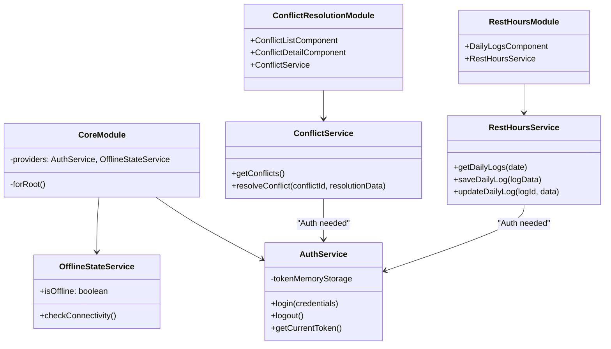
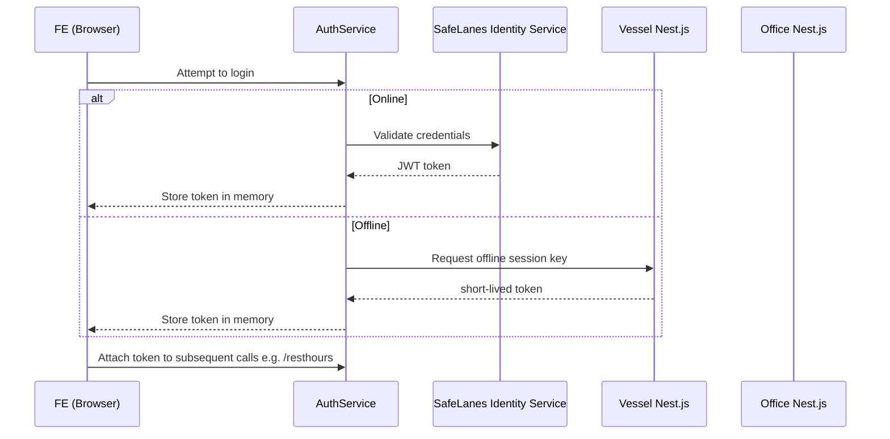

## L3-LLD-FE: Component-Specific Low-Level Design Document for FE

---

This document provides the low-level design details for the SafeLanes Rest Hours Front-End (FE), an Angular 16 microfrontend that runs both on vessels (offline fallback) and in the office environment (integrated via Module Federation with the Sail App). It aims to guide developers through the practical implementation of the FE, showing how UI modules, services, and data flows are structured, secured, and deployed. Design decisions herein reflect the moderate scale defined in the higher-level documents, emphasizing a streamlined, maintainable solution without overengineering.

---

## 1. Component Context

### 1.1 Overall Placement in the Architecture

The Rest Hours FE is one of the system’s principal application layers, sitting atop the Nest.js back-end(s). When used in the vessel environment, it is served locally for offline operation. In the office environment, it is dynamically loaded into the Sail App shell (via Module Federation or a fallback wrapper).

Below is a simplified view of how the FE relates to other major components (adapted from L1-HLD and L2-LLD-IC). Solid arrows show typical user interactions or REST calls:

```mermaid
flowchart LR
    subgraph Vessel
        A1[Angular FE (local offline fallback)]
        B1[Nest.js Vessel]
    end

    subgraph Office
        A2[Angular FE (Module Federation)]
        B2[Nest.js Office]
    end

    A1 -- REST/HTTPS --> B1
    A2 -- REST/HTTPS --> B2
    B1 -- Vessel-Initiated Sync --> B2
```

1. In vessel mode, the FE is loaded from the local Nest.js server (B1).  
2. In office mode, the FE runs within the Sail App shell, calling the office back-end (B2).  
3. Synchronization flows (B1→B2) are triggered by the vessel back-end.

### 1.2 Relevant References from Higher Levels

- From L1-HLD:
  - The FE is a microfrontend that handles daily rest-hour logging, conflict resolution, and other features required for compliance.
  - The vessel environment might be offline for up to 14 days, requiring local hosting to ensure operation.
- From L2-LLD-IC:
  - REST-based interactions with the Nest.js servers for daily logs, planning tasks, and conflict resolution.
  - No inbound firewall changes on vessels; all sync calls originate from vessel back-end to the office back-end.
- Note on “Planning Tasks” Scope: We recommend applying an update to the L1-HLD to explicitly reference Planning functionality. Currently, it is implemented at the L3 level but not mentioned in L1-HLD, causing a scope gap.

- Clarifications Adopted:
  - Minimal local checks (Clarification #1).
  - Strictly defer conflict resolution until connectivity returns (Clarification #2).
  - Single daily offset for time zones (Clarification #3).
  - No queue for error logging (Clarification #4).
  - No service worker asset caching (Clarification #5).
  - Strict memory-only session keys (Clarification #6).
  - Lightweight RxJS-based state management (Clarification #7).
  - Single build with runtime checks (Clarification #8).
  - Warn on version mismatch for most cases; see Section 5.2 for updated handling. (Clarification #9 revised)
  - Simple tabular planning UI (Clarification #10).
  - Minimal test coverage with Jest + Cypress (Clarification #11).
  - Single all-in-one bundle, no “lite” version (Clarification #12).
  - Rely on the office for deeper local audit logs (Clarification #13).
  - Minimal approach to accessibility (Clarification #14).

---

## 2. Component-Level Detailed Design

This section details how the FE is organized internally (modules, services, and core logic), how data flows through it, and how performance and testing are addressed. Although Angular 16 is the framework of choice, the FE is kept lightweight to avoid overcomplex solutions.

### 2.1 High-Level Module Structure

The FE is divided into feature modules, each focusing on a primary function. Conceptually, we have:

- CoreModule:  
  - Provides root-level services (e.g., AuthService, OfflineStateService).  
  - Houses interceptors (HTTP error interceptors, token injection).

- RestHoursModule:  
  - Contains components, services, and models handling daily rest-hour logs.  
  - Offers forms for half-hour block entries, rule-check warnings, and data submission to the Nest.js back-end.

- ConflictResolutionModule:  
  - Displays pending conflicts for Admins.  
  - Shows a day-level “keep vessel or keep office” UI, though the actual final resolution call is done when vessel is online with the office back-end.

- PlanningModule:  
  - Provides a simple daily/weekly table for scheduling tasks.  
  - Minimal logic—no drag-and-drop calendar overhead.  
  Note: This feature is not yet reflected in the L1-HLD, but it is within the current project scope at the L3 level. An L1-HLD update is recommended.

- ReportingModule:  
  - Allows exporting logs (CSV/PDF) for daily or monthly data.  
  - This is optional for vessel usage, but often used in the office environment.

- SharedModule:  
  - Contains shared UI components (tables, modals) and utility pipes.

Below is a simplified class diagram illustrating some representative classes (components and services). For brevity, not every component is shown:



1. AuthService stores JWTs or offline session keys in memory only (no localStorage or sessionStorage) to meet security requirements.  
2. OfflineStateService tracks whether the FE is offline or online, checking connectivity to the local or office Nest.js.  
3. Each feature module encapsulates the relevant components and services.

### 2.2 Key Internal Logic Flows

1. Offline Detection:  
   - The FE pings the configured server endpoint (either vessel or office). If unreachable, the FE toggles OfflineStateService.isOffline to true, which triggers UI offline warnings.  
   - If offline, users must rely on local vessel endpoints (if on a vessel). If that too is unreachable, the FE shows “Server Unavailable” errors.

2. Daily Rest-Hour Saving:  
   - The user fills in half-hour blocks for the selected date.  
   - Before sending, a minimal check ensures total daily hours ≤24.  
   - The FE calls RestHoursService.saveDailyLog() → vessel or office Nest.js.  
   - If the back-end flags conflicts or compliance violations, the FE displays them in real time.

3. Conflict Handling:  
   - If a conflict is detected while offline, the FE defers resolution.  
   - Once online, the ConflictService calls the office back-end’s /conflicts endpoint.  
   - An Admin uses the FE to keep vessel or office data. The FE then calls POST /conflicts/resolve.

### 2.3 Performance Optimization

Given the moderate user count (~30 vessel, ~100 office), advanced client-side optimizations are unnecessary. Key steps:

- Lazy-load feature modules so that large modules like ReportingModule only load on demand.  
- Use ChangeDetectionStrategy.OnPush where feasible.  
- Keep table-based planning in a simple list format (no additional overhead from heavy UI components).

### 2.4 Unit Testing Plan

- Basic coverage using Jest for services, focusing on:  
  - AuthService token logic.  
  - OfflineStateService’s connectivity checks.  
  - RestHoursService’s data transformation.  
- 1–2 main E2E scenarios (Cypress) verifying:  
  - Daily log entry with offline fallback.  
  - Conflict resolution scenario.

We do not aim for advanced offline E2E testing due to scope constraints. Instead, we rely on forming robust manual test procedures plus minimal automation for critical paths.

---

## 3. User Interface (UI) and User Experience (UX) Design

### 3.1 Screen Layouts & Mockups

The FE includes ~20–25 screens or dialogs across its modules. Each screen has a consistent header, navigation bar, and role-based menus that conditionally hide or show administrative features. At a high level:

- Global Layout:
  - Header includes user identity, role info, and an offline/online indicator.  
  - Sidebar or top nav links lead to Daily Logs, Planning, Conflicts, and Reports (if allowed by role).

- DailyLogsComponent Layout:
  - A date selector and 48 half-hour blocks.  
  - “Save” button that triggers the saveDailyLog service call.  
  - A small “Predicted Violations” region that warns the user if the day is over-allocated or near known rule thresholds.

- ConflictListComponent Layout:
  - Displays conflicts returned from the office back-end (when online).  
  - Each item shows date, crew ID, shorthand difference summary (vessel vs. office).  
  - Clicking “Details” opens ConflictDetailComponent with a day-level choice.

- PlanningComponent:
  - Simple table listing tasks, start/end times, assigned crew.  
  - Buttons to add or edit tasks in a pop-up form.

### 3.2 User Interaction Flow Example (Daily Rest-Hour Entry)

Below is a simplified user flow for daily rest-hour entry. This flow covers the offline scenario as well:

```mermaid
flowchart TB
    A[User selects a date] --> B[Fill half-hour blocks]
    B --> C[Click "Save"]
    C --> D[Check OfflineStateService]
    D -->|Online| E[Call REST /resthours/daily]
    D -->|Offline| F[Alert user "Working offline"]
    E --> G[Receive success or violation]
    F --> G[Data saved to local vessel server if reachable]
    G[UI shows success or warnings]
```

1. The user picks a date and edits half-hour blocks.  
2. If the system is offline, the user sees an “Offline” indicator but can still save to the local vessel Nest.js if the LAN is up.  
3. The FE displays any warnings from the back-end, or real-time “predicted violations” from minimal local checks.

### 3.3 Responsiveness

- Primary usage is on standard laptops or desktops.  
- Tablet scenarios are partially tested; minimal breakpoints ensure the layout remains usable on ~768px wide screens.  
- Mobile phone usage is not heavily targeted but uses basic CSS responsive rules to avoid total layout breakage.

---

## 4. API Specifications

Below are minimal endpoint summaries relevant to the FE. All calls require authentication (JWT if online, offline session key if on vessel).

1. Rest-Hour Endpoints  
   - Purpose: Create, read, and update daily logs.  
   - Endpoint:  
     - GET /resthours/daily?date=YYYY-MM-DD  
     - POST /resthours/daily  
     - PUT /resthours/daily/{id}  
   - Authorization Required: Vessel or Office user roles. Admin privileges needed for editing older records (>14 days).  
   - Methods: GET for retrieval; POST/PUT for creation/updating.

2. Conflict Resolution  
   - Purpose: Retrieve and resolve data conflicts.  
   - Endpoint:  
     - GET /conflicts  
     - POST /conflicts/resolve  
   - Authorization Required: Admin or Super Admin.  
   - Methods: GET to list conflicts; POST to submit resolution (KEEP_VESSEL or KEEP_OFFICE).

3. Planning  
   - Purpose: Manage daily or weekly tasks.  
   - Endpoint:  
     - GET /planning  
     - POST /planning  
     - PUT /planning/{taskId}  
   - Authorization Required: Vessel Admin, Office Admin.  
   - Methods: Basic CRUD for tasks.

4. Reporting  
   - Purpose: Generate CSV/PDF exports of daily or monthly logs.  
   - Endpoint:  
     - GET /reports/dailyCSV?date=YYYY-MM-DD  
     - GET /reports/monthlyCSV?month=YYYY-MM  
   - Authorization Required: Vessel or Office users (with corresponding read permissions).  
   - Methods: GET for file downloads.

---

## 5. Security Design Details

### 5.1 Authentication & Authorization
  
The FE obtains a JWT token (when online) from the SafeLanes Identity Service, as described in higher-level documents. The token is stored in memory (AuthService). The OfficeBE itself does not issue JWT tokens; it merely validates them when performing data operations.  
If offline, the FE requests a short-lived session key from the vessel Nest.js server. This key is also kept in memory only.  
Roles (User, Admin, Super Admin, Auditor) are embedded in the token. The FE conditionally renders UI features based on these roles.

Below is an updated security flow diagram for the FE that aligns with the separation of the Identity Service:



### 5.2 Data Protection

- All FE→back-end calls use HTTPS/TLS 1.2+.  
- No local file or DB storage is performed in the FE (besides in-memory state). The vessel’s MySQL DB (not the browser) holds offline data.    
- The FE typically warns on version mismatches. However, if a severe incompatibility is detected (e.g., major semantic version differences), usage may be blocked to prevent data corruption. This update aligns or supersedes L1-KD Decision 3, ensuring we either warn or block depending on mismatch severity, consistent with the moderate scale risk. (Revised Clarification #9)

---

## 6. Error Handling and Logging

### 6.1 Error Handling Strategy

- HTTP error interceptor in CoreModule checks if a request fails.  
- If a 4xx or 5xx error is returned, the FE displays a user-friendly message.  
- If the server is unreachable (offline scenario), the FE sets OfflineStateService.isOffline to true, letting the UI reflect that condition.

```mermaid
flowchart LR
    A[User action triggers service call] --> B[HTTP Request]
    B --> C{Response Code?}
    C -->|2xx| D[Success: Update UI]
    C -->|4xx/5xx| E[Show error message]
    C -->|No response| F[Set offline mode, show "Cannot connect"]
```

### 6.2 Logging

- The FE logs errors to the browser console.  
- No advanced offline logging queue is maintained (Clarification #4).  
- Critical events (e.g., conflict resolution) are fully logged on the back-end.

---

## 7. Deployment and Environment Configuration

### 7.1 Single Build Artifact

- A single Angular build is created. At runtime, environment detection logic chooses local fallback or remote federation.  
- Vessel Deployment: The bundle is placed on the vessel Nest.js server. End users point their browsers to a local IP/domain.  
- Office Deployment: The bundle is published to the Sail App shell with Module Federation.

Below is a simple deployment diagram:

```mermaid
flowchart LR
    subgraph Vessel Env
      V1[Local Nest.js + PM2] --> V2[FE Bundle (Offline Fallback)]
      V3[Browser on Vessel PC] --Load FE--> V2
    end

    subgraph Office Env
      O1[Office Nest.js + PM2]
      O2[Sail App Shell + Module Federation]
      O3[Browser on Office PC] --Load FE--> O2
    end
```

### 7.2 Environment Configurations

- Development:  
  - Local usage with `ng serve`.  
  - Mocks or a dev back-end used for partial tests.

- Staging & Production:  
  - Minimally differ by environment variables indicating the base API URL (vessel vs. office).  
  - No separate “lite” or advanced dynamic build is used (Clarification #12).

---

## 8. Documentation and Coding Standards

- Follows the official Angular Style Guide (e.g., naming conventions, folder structure).  
- Each service or component receives JSDoc-style comments describing logic and usage.  
- Shared code (e.g., utility functions, pipes) resides in the SharedModule.  
- Minimal TypeScript lint rules enforced (e.g., ESLint or TSLint according to the standard SafeLanes approach).

---

## 9. Compliance and Regulatory Requirements

- The FE is not the final authority for maritime rest-hour calculations—it displays back-end–calculated warnings.  
- If a rest-hour conflict or potential regulatory issue arises, the FE ensures an Admin must explicitly confirm which data to keep (no silent overwrites).  
- All overwritten data is stored in the back-end’s audit log, with read-only references for Admins in conflict resolution screens.

---

## 10. Internationalization and Localization

- Basic i18n placeholders exist for standard UI text.  
- No advanced localized date/time logic for partial time-zone transitions; a single daily offset approach is used (Clarification #3).  
- No extended WCAG 2.1 compliance beyond minimal ARIA labels and color contrast is currently enforced.

---

## 11. Cross-Component Interface Contract

The FE strictly uses REST calls to the Nest.js back-ends, referencing L2-LLD-IC for endpoint definitions:

- Data Exchange Patterns:  
  - JSON request and response.  
  - updatedAt timestamps used for conflict detection.  
  - No partial merges at the FE side; merges occur on the back-end.

- Validation Rules:  
  - Basic client-side checks (≤24 hours/day).  
  - Deeper compliance checks happen server-side.

- Error Handling:  
  - The FE displays relevant messages for 4xx/5xx codes.  
  - If offline, it defers conflict resolution.

---

## 12. Inter-Component Communication Standards

- HTTP-based REST calls with TLS 1.2 or higher.  
- JWT-based or short-lived offline session keys for authentication.  
- The FE is not subject to heavy rate limiting given the scale, but any requests hitting errors are retried manually by the user.

---

## 13. Distributed Operations Requirements

Since the FE is stateless aside from in-memory tokens:

- Data Consistency and Conflict Resolution:  
  - If offline, day-level edits are stored in the vessel MySQL via local endpoints. Merging with the office DB occurs once connectivity is restored.  
  - Conflicts for compliance-critical data always require an Admin decision in the FE.

- State Management:  
  - No advanced syncing logic or local offline data store is used beyond immediate calls to local vessel Nest.js.

- Monitoring:  
  - The back-end handles logs and metrics. The FE only logs minimal data to the console for debugging.

---

## 14. Summary of Diagrams

Below is a recap of diagrams used:

1. Component Context Diagram (section 1.1)  
2. Class Diagram for Angular Modules/Services (section 2.1)  
3. UI Flow for Daily Rest-Hour Entry (section 3.2)  
4. Security Flow Sequence Diagram (section 5.1)  
5. Error Handling Flow Diagram (section 6.1)  
6. Deployment Diagram (section 7.1)

These illustrate key interactions and internal structures, focusing on pragmatic solutions aligned with the project’s moderate scale.

---

## Final Remarks

The SafeLanes Rest Hours FE is designed to provide robust day-level logging, minimal offline capabilities, and clear conflict resolution without overengineering. All user inputs are quickly forwarded to the local or office Nest.js server, leaving merges and logging to the back-end. Future enhancements—like advanced offline caching or full offline conflict proposals—can be considered if the project scope expands, but are not presently necessary.

Lastly, we note that “Planning Tasks” and application-level version mismatch handling require alignment in the L1-HLD and L1-KD to ensure a fully consistent blueprint. Updates to both are strongly recommended to remove lingering contradictions.

This concludes the revised L3-LLD-FE Document. For further details, refer to:
- L3-FRS-FE and L3-NFRS-FE for functional and non-functional front-end requirements.  
- L2-LLD-IC for inter-component interactions.  
- L1-HLD for overall system architecture and (recommended) planning features section.  
- L1-KD for key decisions on version compatibility and fallback processes.