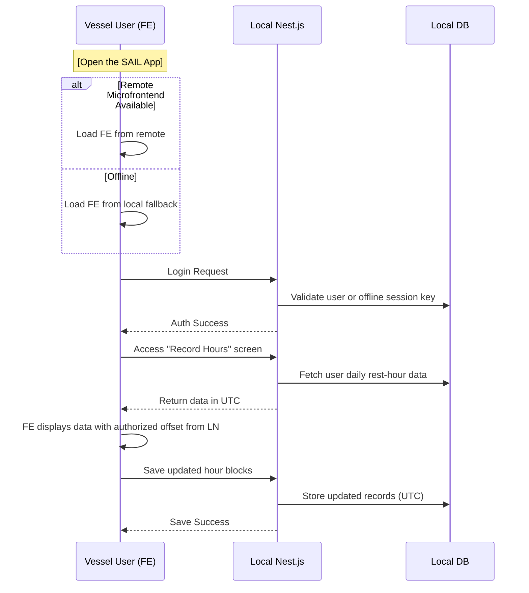
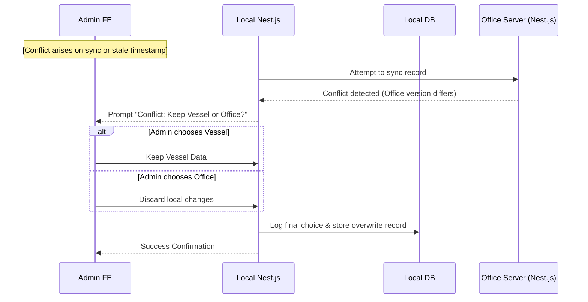

## L3-WF-Rest-Hours-FE: Workflow Details for Rest Hours FE: A Microfrontend for Vessel & Office Users

---

### 1. Introduction
This document has been updated to unify naming conventions and clarify certain offline and conflict-resolution processes. Additional context has been provided throughout to ensure readers fully understand how the front-end interacts with both vessel and office environments at the scale described.

This document outlines the user-facing workflow details for the Rest Hours Front End (FE). It describes how different user roles (Vessel User, Vessel Admin, Vessel Super Admin, Office User, Office Admin, Office Super Admin, and External) interact with the microfrontend to view, record, and manage rest-hour data, both online and offline. The FE uses Angular 16 Module Federation, enabling seamless integration into the existing SafeLanes “Sail App.” Where network connectivity is unavailable, an offline fallback is provided via a bundled local copy.

Key compliance-related mechanics—such as predicted violations, offline sessions, and conflict resolution—are also explained here.

---

### 2. Key Clarifications & FE Implications
Below are important clarifications that drive the FE design and user experience. Each item addresses a specific requirement or challenge in the Rest Hours workflow for maritime compliance at the stated scale. These clarifications help ensure that offline usage, conflict resolution, and display of predicted-violation logic remain consistent with the back-end services and client policies.

1. **Offline Fallback Mechanism**  
   A local server–based fallback is used if the remote microfrontend (remoteEntry) is unreachable. Each vessel’s local server, via Nginx, automatically serves a bundled copy of the FE. A minimal service-worker cache may supplement this approach, but the authoritative fallback mechanism remains the local server bundle to reduce duplication and ensure consistent offline functionality.  
   If the version is out-of-range, the FE only provides a non-blocking warning in offline mode to maintain daily operational compliance. In online mode, the system can optionally block usage if the mismatch is severe, relying on RBAC policy or an admin decision to enforce updates.  
   Additionally, to keep the offline copy reasonably current, the system attempts to update the bundled FE from the office server or a GitLab repository whenever connectivity permits, reducing prolonged version drift.  
   Note that the office environment is generally connected and does not employ a dedicated local fallback. If the office experiences a temporary network outage, the user cannot edit data in true offline mode. Any references to "offline edits" from the office side refer only to potential short-term connectivity loss, not a formal offline approach equivalent to the vessel’s local fallback.

2. **Conflict Handling for Compliance-Critical Data**  
   When vessel and office have both edited the same rest-hour record offline (or in partial connectivity scenarios), a pop-up requests a decision: “Keep Vessel Data” or “Keep Office Data.” By default, only higher-level roles (Vessel Super Admin, Office Admin, or Office Super Admin) have the authority to finalize the overwrite, unless the SAIL application RBAC is configured to allow a Vessel Admin to do so. All overwrites are logged for audit, and some companies may optionally require multi-step approval to discard certain records (future enhancement).   
   The losing version is retained in an immutable, read-only overwrite log, preserving data for audit integrity.  
   If a conflict arises during an unattended or scheduled sync, the system flags the record as “pending resolution” so the sync can continue without indefinite blocking. When an authorized user next accesses the FE, the conflict-resolution pop-up will appear for final decision.  
   Note that the losing version is never permanently purged, preserving a complete chain of changes.

3. **Offline Session Expiry**  
   - Short-lived offline session keys can remain valid up to 14 days. Organizations can reduce this duration if desired for stricter security, aligning with maritime or corporate guidelines.  
   - On expiry, the FE blocks usage until an Admin override is performed or connectivity is restored. If a Vessel Super Admin is present, they may also provide the necessary override.

4. **Predicted Violations**  
   - UI shows small warning icons (exclamation marks or color-coded alerts) indicating potential upcoming violations. The FE retrieves these predictions from the Nest.js back-end to ensure a single source of truth. No local rule-engine processing is performed in the FE.  
   - The server remains the final authority on actual violations.

5. **Partial Form Submissions & Unsaved Changes**  
   - The FE prompts users upon navigation away with unsaved hours: “Do you want to discard changes?”

6. **Concurrency & Multi-User Editing**  
   The FE does not impose real-time locking. Instead, each rest-hour record retains a last-modified timestamp. When a user saves changes, the Nest.js back-end checks if the record has been updated since it was fetched. If so, the system calls the existing conflict-resolution pop-up, ensuring no silent overwrites occur even if two users are online simultaneously.  
   Conflicts can occur not only between vessel and office data, but also among multiple users within the same role or environment. If so, the same conflict-resolution pop-up is triggered (e.g., “Your version vs. Their version”), preserving data integrity across concurrent edits.

7. **Basic Local Input Checks Only**  
   The FE performs minimal local checks (e.g., ensuring that total hours do not exceed 24 per calendar day). All official violation detection and predicted violations are handled fully by the back-end service, which remains the final authority.

8. **Local Time Offset**  
   The FE fetches the authoritative ship time offset from the local Nest.js config to display rest-hour blocks. If this offset is unavailable or out of sync beyond a threshold, the FE issues a clear warning. The system may optionally block recording, but in practice offline usage is prioritized, so the system generally does not prevent data entry solely for offset issues. All data remains in UTC internally so day-boundary checks stay consistent with STCW and MLC obligations.  
   If the offset drifts beyond a defined tolerance (for example ±30 minutes), the FE prompts the user or an Admin to confirm or correct the offset in alignment with STCW A-I/4. This step helps avoid misalignment of day boundaries and ensures compliance records are accurate.

9. **Editing Past Days**  
   - By default, the system allows editing within the “current open period” (e.g., the last 14 days) as defined by company policy. Beyond that period, the FE prompts for an Admin override so that older records can be unlocked for edits, ensuring compliance with maritime regulations.

10. **Offline Status & Sync**  
    - The FE displays a simple “Offline Mode” banner when disconnected.  
    - All sync logic is managed behind the local Nest.js server; the user is not shown a detailed queue.

11. **Planning & Partial Tasks**  
    - Two distinct screens are provided for Fixed Tasks and Variable Tasks, in alignment with L1-WF. They may share a common half-hour grid component under the hood, but are presented separately to reflect different workflow and data requirements (Screens V3.0a for Fixed Tasks and V3.0b for Variable Tasks).

12. **Overwrite Logs**  
    Overwritten compliance data is retained server-side. A basic “View Overwrites” option is planned for Admins to see changes. The overwrite audit is kept in an append-only, read-only log to protect data integrity and meet audit requirements.

13. **Large Data Sets**  
    - The FE can load large time ranges by fetching data in chunks (lazy loading).

14. **Attachments in Variable Tasks**  
    - The default file size limit is 5 MB, showing a warning for larger files. If needed, chunked or deferred uploads can be considered for bigger attachments, subject to bandwidth constraints.

15. **Additional Concurrency Safeguards**  
    - To minimize unintentional overwrites, the FE includes a last-modified check on each update request. If the server detects a mismatch, it triggers conflict resolution. This helps preserve data integrity in typical usage scenarios, aligned with the moderate concurrency (up to ~100 office concurrent users and ~30 crew per vessel) described in earlier documents.

---

### 3. Primary UI Modules
The Rest Hours FE presents several modular screens (or routes). Role-based access ensures users only see the features they are permitted to use:

1. Dashboard & Analytics (Vessel or Office)  
2. Recording Screens (Daily/Hourly Entry)  
3. Planning Screens (Fixed & Variable Tasks)  
4. Conflict Resolution Pop-Up (Admin or Super Admin only, subject to RBAC)

Information on Access Control is handled entirely within the main SAIL Admin Panel, and any link from the Rest Hours FE simply redirects to that panel if needed.

Typical user roles and their main areas of interest:
- **Vessel User**: Daily self-reporting, viewing personal predicted violations.  
- **Vessel Admin / Vessel Super Admin**: Monitoring department or entire vessel data, planning tasks, editing records for subordinates, resolving conflicts (if permitted by RBAC) when operating offline.  
- **Office User / Office Admin / Office Super Admin**: Viewing multi-vessel summaries, analytics, and cross-vessel rest-hour data, limited or full edit rights (depending on policy).  
- **External (read-only)**: Viewing only, with access typically restricted to vessel-level dashboards (e.g., Screen V1.0a) if configured by the SAIL Admin. They do not gain access to broad fleet analytics screens.

---

### 4. Detailed Front-End Workflows by Role
Below are the primary workflows and user tasks, broken down by role. These descriptions assume the offline fallback is in place on vessels, and the office environment is generally connected unless otherwise stated. Each role’s access is governed by SafeLanes RBAC policies.

#### 4.1 Vessel User Workflow
This sub-section describes the typical tasks of a Vessel User, focusing on self-reporting rest hours and handling potential violations in both online and offline modes.

1. Launch the SAIL App. The local server fallback checks connectivity to load the remote microfrontend or the bundled copy if offline.  
2. Sign in using existing SAIL credentials. If offline and an unexpired offline session key exists, the user proceeds. Otherwise, the system requires a local Admin or Vessel Super Admin override.  
3. Select “Rest Hours” from the main menu. The FE pulls vessel- and user-specific data from the local Nest.js instance.  
4. The user navigates to the “Recording Form (Screen V2.0c)” listing each work/rest block in half-hour increments.  
   - The FE displays server-provided predicted violations with a small warning icon, ensuring the server’s rule set is used for final checks.  
   - The user can adjust entries and click “Save.” An unsaved-changes prompt appears if they attempt to leave before saving.  
5. The system stores the updated data locally in UTC. Online or on the next sync, changes push to the office server.

#### 4.2 Vessel Admin Workflow
Department-level monitoring and editing. Vessel Admins oversee crew entries within their department and can plan tasks or resolve certain issues under policy-defined permissions.

1. Open the “Rest Hours” module via the local or remote microfrontend.  
2. Log in with Vessel Admin credentials.  
3. Access department-level dashboards:  
   - See summarized rest-hour compliance, predicted violations, or missing data for each subordinate.  
4. Edit Crew Records (if granted by policy):  
   - Select a user, open the day’s blocks, and correct or fill missing entries.  
   - Saving changes triggers local checks and final server validation. If a concurrency conflict is detected, the conflict-resolution dialog appears.  
5. Create or Update Planning Data (Fixed & Variable Tasks):  
   - Plan watch schedules or daywork tasks in the half-hour block grid.  
   - Mark tasks as “planned” (grey). Crew confirm actual hours as green/blue blocks.

#### 4.3 Vessel Super Admin Workflow
A Vessel Super Admin can access the entire vessel’s data and override or edit any user’s records. They also handle conflict resolution where vessel data differs from office data, if permitted.

1. Sign in with Vessel Super Admin credentials (online or offline).  
2. View the vessel-level Rest Hours Dashboard with aggregated metrics.  
3. Optionally override or adjust any user’s data, including Admins, if permitted.  
4. Resolve Conflicts if offline changes differ from office changes:  
   - In the conflict pop-up, decide “Keep Vessel Data” or “Keep Office Data,” subject to RBAC.  
   - The system logs the overwrites for later audit.

#### 4.4 Office User / Office Admin Workflow
Office-based users (including Office Admins) interact with rest-hour data via fleet-level dashboards. They can view analytics, drill down into vessels’ entries, and—depending on policy—edit records or resolve conflicts.

1. Log into the SAIL App from an office device.  
2. Select “Rest Hours” to open the aggregated fleet-level dashboard.  
3. Apply filters (fleet, vessel group, date ranges) to see aggregated metrics and watchlists.  
4. If permitted to edit vessel data:  
   - Drill down to a specific vessel and crew.  
   - Open half-hour blocks for a given day.  
   - Make corrections (triggering local checks) and save. If the record’s last-modified timestamp has changed, the user is prompted with the conflict-resolution pop-up.  
5. Review predicted violations or incomplete data.

#### 4.5 Office Super Admin Workflow
Office Super Admins have full system access, can edit any vessel’s data across the fleet, and adjust advanced policies or access controls.

1. Has full system access.  
2. Can view or edit any vessel’s records across the organization.  
3. Can manage advanced access controls and confirm conflict resolutions flagged by vessel or office changes.

#### 4.6 External (Read-Only) Workflow
External (e.g., auditor) users may be granted read-only access for compliance reviews.

1. Logs in via SAIL with a read-only role.  
2. Views only the designated vessel-level dashboard (e.g., Screen V1.0a) if allowed by the client’s configuration. They do not have access to broader analytics or multi-vessel summaries unless explicitly granted.

---

### 5. Integration Points & Offline-Online Interactions
This section explains how the Rest Hours FE interacts with both the vessel’s local environment and the office environment, focusing on how data is transferred and how conflicts are resolved in online/offline scenarios. The subsequent list outlines the key mechanisms enabling synchronization and conflict resolution across these environments.

1. The microfrontend interacts with the local Nest.js service on the vessel or the office Nest.js service, depending on the user environment.  
2. When offline, the FE uses stored sessions and local DB writes.  
3. Upon reconnection, the local server syncs changes with the central office DB. If a compliance-critical record is in conflict, the FE displays a pop-up to any authorized Admin or Super Admin.  
4. A last-modified timestamp check ensures that if two users simultaneously edit the same record, the second user’s update is flagged as a conflict before overwriting can occur. This avoids silent data loss scenarios, particularly during online concurrency.  
5. If no user session is open during a scheduled or automatic sync, any detected conflicts are marked “pending resolution.” This ensures the rest of the data can replicate without stalling forever. An Admin can later resolve these conflicts upon logging into the FE.

Note: If the local Nest.js service is unavailable, the FE displays an error indicating rest-hour data cannot be accessed or recorded. Users must report the issue so the service can be restarted or repaired.

---

### 6. Mermaid Workflow Diagrams

#### 6.1 Typical Daily Usage (Vessel User)

#### 6.2 Conflict Resolution (Admin Overwrite)

If this sync occurs without an active FE session, LN marks the record pending resolution and completes the data transfer of non-conflicting records.

---

### 7. Conclusion
This workflow specification provides a comprehensive view of how the Rest Hours Front End behaves across different user roles, both online and offline. It clarifies conflict resolution, partial editing, the display of server-calculated predicted violations, and more—ensuring the development team can implement the FE logic with confidence.

All final data merges and validations are performed by the back-end or from local servers as applicable, ensuring no silent overwrites of critical compliance data and maintaining a verifiable audit trail in line with maritime regulations. Office Super Admins or authorized roles can manage access controls in the main SAIL admin panel as outlined in higher-level documents (L1/L2), preserving clarity on how permissions are granted or revoked across the entire system.