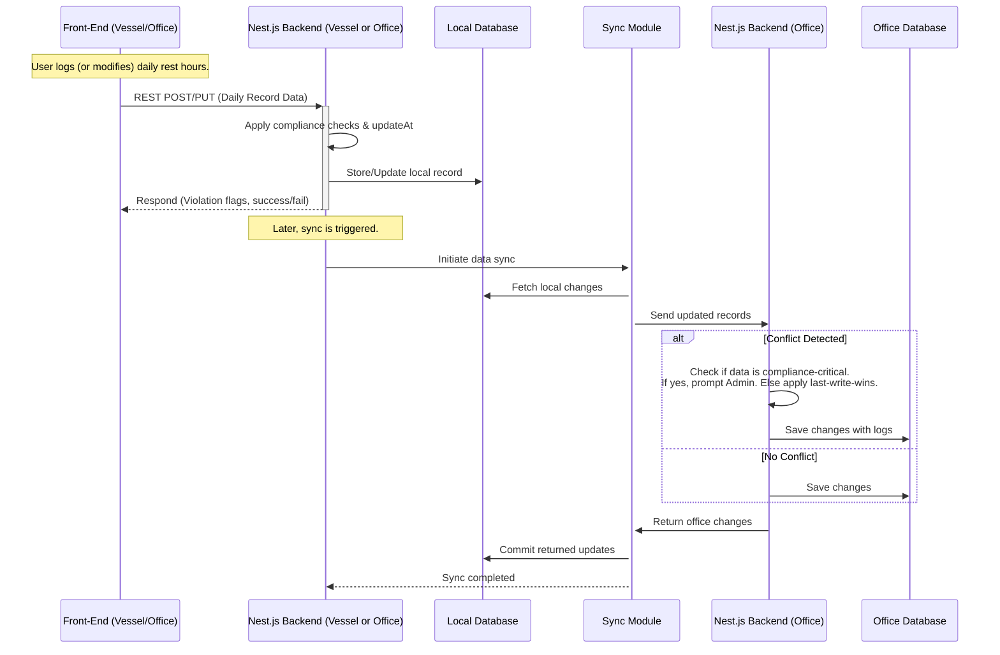

## L3-WF-RestHoursBackend: Workflow Details for RestHoursBackend: A microservice for core data processing and compliance checks.

This document provides a comprehensive overview of workflows within the SafeLanes RestHoursBackend (Nest.js) component, including revised clarifications on the 14-day offline session key limit, allowing a local Master or Admin override after 14 days if connectivity is still unavailable, pre-merge Admin review for compliance data overwrites, and soft-deletion handling. The backend acts as a standalone microservice that manages rest-hour data, executes validation rules, handles offline session keys, and synchronizes vessel/office records. Although user actions originate from the front-end (vessel or office), the workflows described here focus on how the RestHoursBackend processes and responds to these inputs.

---
## Table of Contents
1. [Introduction](#introduction)  
2. [Key Workflows](#key-workflows)  
   1. [Session Management and Authentication](#session-management-and-authentication)  
   2. [Data Submission and Validation](#data-submission-and-validation)  
   3. [Conflict Resolution](#conflict-resolution)  
   4. [Data Synchronization](#data-synchronization)  
   5. [Rule Set Updates](#rule-set-updates)  
6. [Component-Specific Mermaid Workflow Diagram](#component-specific-mermaid-workflow-diagram)  
7. [Integration Points Diagram](#integration-points-diagram)  
8. [Additional Notes](#additional-notes)  

---

## Introduction
The RestHoursBackend manages all server-side logic for rest-hour data, including storing daily work/rest blocks (half-hour granularity), performing compliance checks (MLC/STCW/OPA), and orchestrating vessel-to-office data synchronization. It runs per vessel in offline mode and as a consolidated backend at the office.

The microservice enforces role-based access (Vessel User, Vessel Admin, Office User, Office Admin, Office Super Admin, External (read-only), and “Master” (alias for Vessel Super Admin)) by verifying JWT tokens or short-lived offline session keys. It also implements conflict detection logic when both vessel and office records are modified offline, ensuring special handling for compliance-critical data.

---

## Key Workflows

### Session Management and Authentication
This workflow ensures secure authentication and session handling, both online (with JWT tokens) and offline (with short-lived keys).

Below are the major points regarding session management, covering how the backend validates user credentials under normal and offline conditions.

• When online, the backend validates JWTs against the SafeLanes identity service.  
• If the vessel is offline and JWT tokens have expired, a local session key is generated, valid for a maximum of 14 days.  
• If the identity service becomes unreachable during expected online operation for the vessel environment, the system can temporarily switch to offline session key handling.  
• If the identity service becomes unreachable at the office, Office users must wait until connectivity is restored before continuing normal operations.  
• If an offline period extends beyond 14 days, a Vessel Master (Super Admin) or Admin can perform a local override to renew the offline session key and continue operations, aligning with L1-OVERVIEW requirements.  
• Once connectivity is restored, re-authentication with the central identity service remains mandatory to ensure updated access rights.  
• All session data is stored in the local DB (vessel) or central DB (office), reflecting the user’s role and permissions.

#### External Role Error Handling
If an External (read-only) user attempts to modify data or submit new records, the backend immediately rejects the request with an appropriate HTTP error (e.g., 403 Forbidden). Conflict resolution does not apply to the External role, as they cannot overwrite or submit data. The system logs any such attempt in the audit trail to ensure transparency.

---

### Data Submission and Validation
This sub-section explains how user-submitted rest-hour records are validated, stored, and flagged for regulatory compliance checks within the RestHoursBackend.

When users submit rest-hour data (crew logs, planned tasks, or corrections) via the front-end, it arrives through REST endpoints at the backend.

#### Overview
• Each daily record is stored as a single row with a sub-block array capturing half-hour entries.  
• The backend automatically runs compliance checks (violation detection) for MLC, STCW, and OPA rules.  
• Data is timestamped in UTC and then offset for local display, enabling consistent merges.

#### Steps
1. Front-end (vessel or office) sends a POST/PUT request with daily record data (including half-hour sub-blocks).  
2. The backend parses the record, applying validation and MLC/STCW/OPA rule checks.  
3. If a rule is violated (e.g., daily hour limit exceeded), it flags the record with relevant violation codes.  
4. The backend stores the new or updated record in the local DB (vessel or office).  
5. `updatedAt` timestamps are assigned for subsequent synchronization.

#### Handling Partial Data Submission Errors
In alignment with the incremental data saving approach described in L1-WF, the backend supports partial data submissions by marking them as “draft” or “incomplete.” This allows crew or office users to save partially filled daily logs.  
Full compliance validation is performed each time the user selects “Apply” or “Save,” consistent with L1-WF. If a record remains in “draft” state, the backend still checks for violations immediately and flags them, but the user may proceed if the data is incomplete. When the user attempts to finalize, incomplete fields will block finalization, and the presence of violations does not prevent finalization, allowing the user to save and proceed even if violations remain. If the user attempts to finalize an incomplete record containing invalid data, the backend rejects that finalization request and returns an error summarizing the invalid fields, ensuring consistent and accurate data.

---

### Conflict Resolution
This section describes how the backend detects and handles conflicting edits to the same rest-hour record, ensuring compliance-critical data is protected from silent overwrites.

Conflicts arise when both vessel and office attempt to modify the same record offline. For non-critical fields, the system applies a last-write-wins policy automatically. For rest-hour compliance data (e.g., daily hours, violation flags), the system requires an Admin or Vessel Super Admin to confirm any overwrite before finalizing, preventing silent overwrites. Overwritten data is also logged, and administrators may optionally review these logs after the merge.

Examples of compliance-critical fields include daily rest hours, half-hour block entries, assigned violation codes, and non-conformity indicators directly impacting official rest-hour records. Non-critical fields may include optional free-text comments or metadata that do not affect compliance calculations.

If an Admin rejects the overwrite for compliance-critical data, the newly received changes are not applied, and the existing data remains in place. A record of the rejected update is still logged for audit purposes.

Additionally, to address concurrency among multiple office users, if multiple office users modify the same compliance-critical field at overlapping times, the system detects a conflict. The conflict resolution then prompts an Admin or Office Super Admin to confirm which version to keep, preventing silent overwrites of compliance-critical data. For non-critical fields, the last-write-wins policy applies, and the final saved edit is retained. This ensures that concurrency at the office level is handled consistently with the system’s overall conflict resolution procedures.

#### Overwrite Log Access
All overwritten updates are stored in a protected audit log. Authorized administrators can view or export this log through a dedicated endpoint or an admin console interface. This allows thorough post-merge review of compliance-critical changes, ensuring that any overwritten entries remain fully traceable for regulatory and internal audits.

---

### Data Synchronization
The data synchronization workflow transfers updated rest-hour records between vessel and office backends, detecting conflicts and applying the appropriate resolution policies.

Data synchronization covers the incremental data flow between vessel and office, typically performed daily or on demand.

#### Overview
• The vessel backend accumulates local updates with `updatedAt` timestamps.  
• The office backend also accumulates any changes (historical corrections by authorized users).  
• Sync uses chunked, transaction-like REST calls to ensure partial-failure handling (if a batch fails, that batch is retried).  
• Since the system now applies a unified last-write-wins policy for non-critical fields and prompts for Admin review for compliance data, overwritten items are always logged. Any compliance-critical conflict triggers an Admin review before finalizing the merge.

#### Steps
1. Vessel triggers a sync (scheduled or manual).  
2. The vessel backend collects all records with `updatedAt > lastSyncTime`.  
2a. In order to mitigate potential clock drift between vessel and office systems, each side may also store local-time offsets or use monotonic counters, as recommended in L1-OVERVIEW. This helps ensure that no valid updates are missed or incorrectly overwritten due to clock discrepancies.  
3. The system transmits batches to the office backend via secure TLS.  
4. The office backend processes each batch; it checks for conflicts. Non-critical fields follow last-write-wins. Compliance data triggers Admin review before overwrites. Overwritten updates are retained in a protected log.  
5. The office similarly sends back any updates for the vessel (e.g., historical corrections).  
6. Any mid-transfer failures (network drop) cause a batch-level retry.  
7. Once all batches complete, both sides update `lastSyncTime`, finalizing the sync session.

When a record is flagged with `isDeleted` (soft delete), that record is also included in the sync payload. The destination side sets the corresponding record to `isDeleted`, ensuring synchronization of deletion status without physically removing data, which preserves the audit trail.

---

### Rule Set Updates
The following points cover how updated rule parameters (MLC, STCW, OPA) are managed and retrieved by the vessel for ongoing compliance checks.

MLC, STCW, and OPA violation thresholds (and other regulatory parameters) are stored externally in versioned JSON or YAML files.

#### Overview
• The vessel caches the latest known rule set for offline compliance checks.  
• Upon each synchronization, version strings are compared.  
• If a newer rule set is found, the vessel automatically downloads it (and logs the change).  
• The updated rules immediately apply to new or edited rest-hour records.  
• At the current scale, there is no automatic recheck of historical records unless specifically triggered by an Admin or automated job.

---

## Component-Specific Mermaid Workflow Diagram
Below is a component-focused sequence of how the backend processes user actions (originating from the vessel or office) and manages data synchronization:



---

## Integration Points Diagram
This figure highlights how the backend integrates with major system components, focusing on compliance workflows and authentication handoffs:

```mermaid
flowchart LR
    subgraph Vessel
    A[Front-End <br>(Angular Microfrontend)] --> B[Local Nest.js Backend]
    B --> D[Local DB (MySQL)]
    end

    subgraph Office
    E[Identity Service<br>(JWT Authority)]
    F[Office Nest.js Backend]
    G[Office DB (MySQL)]
    end

    B <--> F:::syncLink
    D:::dbLink --sync--> G:::dbLink
    B --authCheck--> E

    classDef syncLink stroke:#396,stroke-width:2px,stroke-dasharray:5,fill:none
    classDef dbLink stroke:#999,stroke-width:1px,fill:none
```

Note: The Office environment also includes a front-end interface (analogous to A), even though it is not depicted as a separate node in the Office subgraph. Office users interact with their own Angular microfrontend, which connects to F (Office Nest.js Backend) in a similar manner.

- B ↔ F: Data synchronization channel (TLS encrypted).  
- B → E: Authentication checks when online.  
- D → G: Indirect data sync (batched or continuous).  

---

## Additional Notes
This section provides final clarifications and important reminders about the RestHoursBackend’s design and operation.

1. The offline session key remains valid for up to 14 days. If the vessel remains offline beyond 14 days, a Master (Vessel Super Admin) or Admin can locally renew the offline session key. Once connectivity is finally restored, re-auth with the central identity service is mandatory.  
2. For non-critical fields, last-write-wins applies. Compliance-related rest-hour records require Admin review before overwriting. All changes are logged for audit.  
3. Because of the current scale and simpler data model, each day’s data is stored as a single record with half-hour sub-blocks. This can lead to entire-day conflicts if two parties update different half-hour segments offline, but it is pragmatically acceptable for now due to moderate concurrency requirements.  
4. All timestamps are stored in UTC. The UI handles local offsets for displaying day boundaries.  
5. Office edits are primarily aimed at historical corrections by default, but the system can also permit editing current records if allowed by client policy in the role-based access configuration.  
6. Rule set updates occur automatically during sync by comparing version strings; the system can re-check historical data manually if needed, but typically only new or updated records are validated under the revised rules.  
7. Synchronization uses a transaction-like approach, committing each data batch once confirmed; partial failures lead to retries.  
8. To align with L1-OVERVIEW recommendations, the microservice can optionally leverage MySQL TDE or disk encryption when the client elects to enable encryption at rest. This is strongly advised for safeguarding personally identifiable data.  
9. "Master" in vessel context is synonymous with Vessel Super Admin.  
10. All replaced or overwritten data is kept in an overwrite log to maintain an audit trail; administrators can view or export this log to support compliance investigations as needed.  
11. The “isDeleted” soft-delete flag is an internal mechanism to preserve records for auditing and compliance. While higher-level documents do not explicitly describe deletion, physically removing rest-hour entries is avoided to maintain an immutable log.