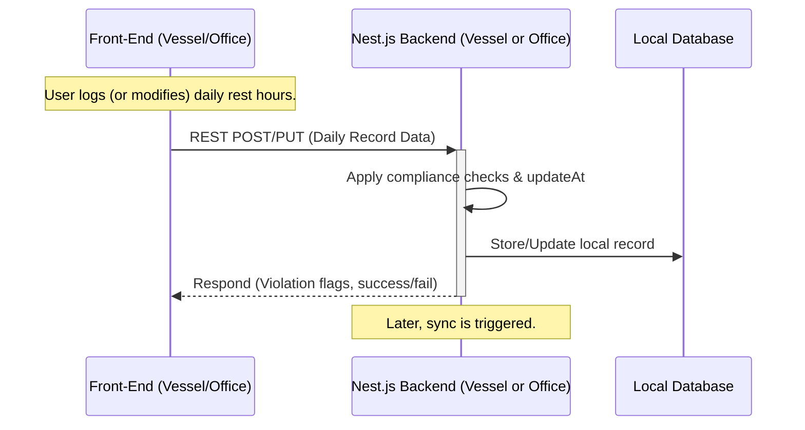
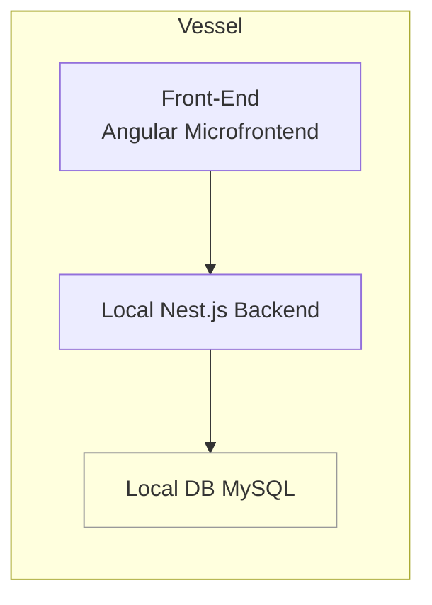

## L3-WF-RestHoursBackend: Workflow Details for RestHoursBackend: A microservice for core data processing and compliance checks.

This document provides a comprehensive overview of workflows within the SafeLanes RestHoursBackend (Nest.js) component, and soft-deletion handling. The backend acts as a standalone microservice that manages rest-hour data, executes validation rules. Although user actions originate from the front-end (vessel or office), the workflows described here focus on how the RestHoursBackend processes and responds to these inputs.

---

### Table of Contents

1. [Introduction](#introduction)  
2. [Key Workflows](#key-workflows)  
   1. [Session Management and Authentication](#session-management-and-authentication)  
   2. [Data Submission and Validation](#data-submission-and-validation)  
   3. [Conflict Resolution](#conflict-resolution)  
   4. [Data Synchronization](#data-synchronization)  
   5. [Rule Set Updates](#rule-set-updates)  
3. [Component-Specific Mermaid Workflow Diagram](#component-specific-mermaid-workflow-diagram)  
4. [Integration Points Diagram](#integration-points-diagram)  
5. [Additional Notes](#additional-notes)

---

### Introduction

The RestHoursBackend manages all server-side logic for rest-hour data, including storing daily work/rest blocks (half-hour granularity), performing compliance checks (MLC/STCW/OPA). It runs per vessel in offline mode and as a consolidated backend at the office.

The microservice enforces role-based access (Vessel User, Vessel Admin, Vessel Super Admin, Office User, Office Admin, Office Super Admin, External (read-only)) by verifying JWT tokens. It also implements conflict detection logic (simple last-write-wins strategy) when both vessel and office records are modified offline.

---

### Key Workflows

#### Session Management and Authentication

This workflow ensures secure authentication and session handling, both online and offline (with JWT tokens).

Below are the major points regarding session management, covering how the backend validates user credentials under normal and offline conditions.

• Always, the backend validates JWTs against the SafeLanes identity service.

• All session data is stored in the local DB (vessel) or central DB (office), reflecting the user's role and permissions.

##### External Role Error Handling

If an External (read-only) user attempts to modify data or submit new records, the backend immediately rejects the request with an appropriate HTTP error (e.g., 403 Forbidden). Conflict resolution does not apply to the External role, as they cannot overwrite or submit data. The system logs any such attempt in the audit trail to ensure transparency.

---

#### Data Submission and Validation

This sub-section explains how user-submitted rest-hour records are validated, stored, and flagged for regulatory compliance checks within the RestHoursBackend.

When users submit rest-hour data (crew logs, planned tasks, or corrections) via the front-end, it arrives through REST endpoints at the backend.

##### Overview

• Each daily record is stored as a single row with a sub-block array capturing half-hour entries.  
• The backend automatically runs compliance checks (violation detection) for MLC, STCW, and OPA rules.  
• Data is timestamped in UTC and then offset for local display, enabling consistent merges.

##### Steps

1. Front-end (vessel or office) sends a POST/PUT request with daily record data (including half-hour sub-blocks).  
2. The backend parses the record, applying validation and MLC/STCW/OPA rule checks.  
3. If a rule is violated (e.g., daily hour limit exceeded), it flags the record with relevant violation codes.  
4. The backend stores the new or updated record in the local DB (vessel or office).  
5. `updatedAt` timestamps are assigned for subsequent synchronization.

##### Handling Partial Data Submission Errors

Full compliance validation is performed each time the user selects "Apply" or "Save," consistent with L1-WF. There is no partial data submission or draft saved.  
---

#### Conflict Resolution

This section describes how the backend detects and handles conflicting edits to the same rest-hour record, ensuring compliance-critical data is protected from silent overwrites.

Conflicts arise when both the user and admin within the same premise (vessel or office) attempt to modify the same record offline. For all fields, the system applies a last-write-wins policy automatically. Overwritten data is also logged, and administrators may optionally review these logs after the merge.

Examples of compliance-critical fields include daily rest hours, half-hour block entries, assigned violation codes, and non-conformity indicators directly impacting official rest-hour records. Non-critical fields may include optional free-text comments or metadata that do not affect compliance calculations.

Additionally, to address concurrency among multiple office users, if multiple office users modify the same compliance-critical field at overlapping times, the system detects a conflict. The conflict resolution then applies the last-write-wins policy, and the final saved edit is retained. This ensures that concurrency at the local environment is handled consistently with the system's overall conflict resolution procedures.

##### Overwrite Log Access

All overwritten updates are stored in a protected audit log. Authorized administrators can view or export this log through a dedicated endpoint or an admin console interface. This allows thorough post-merge review of compliance-critical changes, ensuring that any overwritten entries remain fully traceable for regulatory and internal audits.

---

#### Rule Set Updates

The following points cover how updated rule parameters (MLC, STCW, OPA) are managed and retrieved by the vessel for ongoing compliance checks.

MLC, STCW, and OPA violation thresholds (and other regulatory parameters) are stored externally in versioned JSON or YAML files.

##### Overview

• The vessel caches the latest known rule set for offline compliance checks.  
• The updated rules immediately apply to new or edited rest-hour records.  
• At the current scale, there is no automatic recheck of historical records unless specifically triggered by an Admin or automated job.

---

### Component-Specific Mermaid Workflow Diagram

Below is a component-focused sequence of how the backend processes user actions (originating from the vessel or office):

---

### Integration Points Diagram

This figure highlights how the backend integrates with major system components, focusing on compliance workflows and authentication handoffs:

Note: The Office environment also includes a front-end interface (analogous to A), even though it is not depicted as a separate node in the Office subgraph. Office users interact with their own Angular microfrontend, which connects to F (Office Nest.js Backend) in a similar manner.

- B ↔ F: Data synchronization channel (TLS encrypted).  
- B → E: Authentication checks when online.  
- D → G: Indirect data sync (batched or continuous).

---

### Additional Notes

This section provides final clarifications and important reminders about the RestHoursBackend's design and operation.

1. For all fields, last-write-wins applies. All changes are logged for audit.  
2. Because of the current scale and simpler data model, each day's data is stored as a single record with half-hour sub-blocks.   
3. All timestamps are stored in UTC. The UI handles local offsets for displaying day boundaries.  
4. Office edits are primarily aimed at historical corrections by default, but the system can also permit editing current records if allowed by client policy in the role-based access configuration.  
5. Rule set updates occur automatically during sync by comparing version strings; the system can re-check historical data manually if needed, but typically only new or updated records are validated under the revised rules.  
6. To align with L1-OVERVIEW recommendations, the microservice can optionally leverage MySQL TDE or disk encryption when the client elects to enable encryption at rest. This is strongly advised for safeguarding personally identifiable data.  
7. "Master" in vessel context is synonymous with Vessel Super Admin.  
8. All replaced or overwritten data is kept in an overwrite log to maintain an audit trail; administrators can view or export this log to support compliance investigations as needed.  
9. The "isDeleted" soft-delete flag is an internal mechanism to preserve records for auditing and compliance. While higher-level documents do not explicitly describe deletion, physically removing rest-hour entries is avoided to maintain an immutable log.

